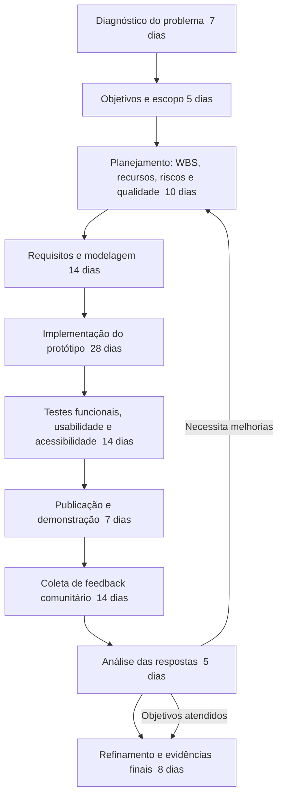

# Diagrama da Metodologia do Projeto (Kanban e validação via Google Forms)

## Versão textual curta (para colar no DOCX)

Diagnóstico do problema -> Objetivos e escopo -> Planejamento -> Requisitos e modelagem -> Implementação -> Testes -> Publicação -> Coleta de feedback -> Análise -> Refinamento e evidências finais.
