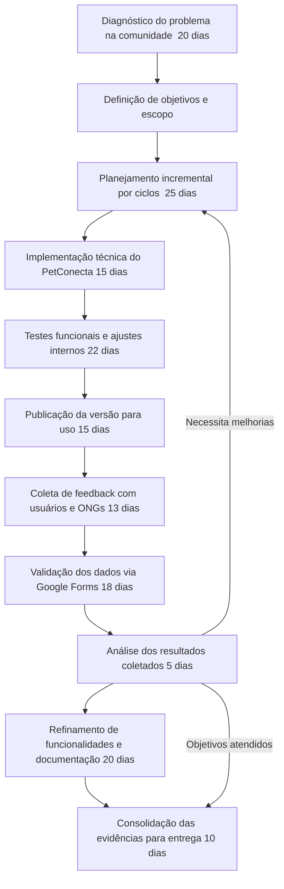

# Diagrama da Metodologia do Projeto (com validação via Google Forms)

## Versão textual curta (para colar no DOCX)

Diagnóstico do problema -> Definição de objetivos -> Planejamento por ciclos -> Implementação -> Testes -> Publicação -> Coleta com usuários/ONGs -> Validação dos dados via Google Forms -> Análise dos resultados -> Refinamento -> Evidências finais.
