# Diagrama da Metodologia do Projeto (Kanban e validação via Google Forms)

```mermaid
flowchart LR
      INI(("Início do projeto")) --> A

      subgraph BKL["Backlog"]
            A["Levantamento do setor de aplicação<br>10 dias"]
      end

      subgraph PLN["Planejado"]
            B["Levantamento de requisitos<br>7 dias"]
            C["Análise dos requisitos<br>6 dias"]
      end

      subgraph AND["Em andamento"]
            D["Protótipo navegável<br>8 dias"]
            E["Implementação e integração tecnológica<br>28 dias"]
            F["Deploy no Firebase<br>1 dia"]
      end

      subgraph VAL["Em validação"]
            G["Testes funcionais, usabilidade e acessibilidade<br>14 dias"]
            H["Publicação e demonstração da versão final<br>comunidade<br>7 dias"]
            I["Coleta de feedback comunitário<br>14 dias"]
            J["Análise das respostas<br>5 dias"]
      end

      subgraph CON["Concluído"]
            K["Protótipo<br>Deploy<br>Refinamento e evidências<br>Coleta de feedback<br>Análise das respostas<br>Testes<br>Publicação"]
            L["Organização dos arquivos de evidências e<br>preenchimento do relatório<br>8 dias"]
      end

      A --> B --> C --> D --> E --> F --> G --> H --> I --> J --> K --> L --> FIM(("Fim do projeto"))

      classDef inicio fill:#f0fdfa,stroke:#2dd4bf,color:#111
      classDef backlog fill:#f5f5f5,stroke:#616161,color:#111
      classDef planejado fill:#fff3cd,stroke:#b58105,color:#111
      classDef andamento fill:#d9edf7,stroke:#31708f,color:#111
      classDef validacao fill:#dff0d8,stroke:#3c763d,color:#111
      classDef concluido fill:#e2e3e5,stroke:#343a40,color:#111

      class INI,FIM inicio
      class A backlog
      class B,C planejado
      class D,E,F andamento
      class G,H,I,J validacao
      class K,L concluido
```

## Versão textual curta (para colar no DOCX)

Backlog: levantamento do setor de aplicação -> Planejado: levantamento e análise de requisitos -> Em andamento: versão navegável e implementação -> Em validação: testes, publicação, feedback e análise -> Concluído: refinamento e evidências finais (107 dias).
