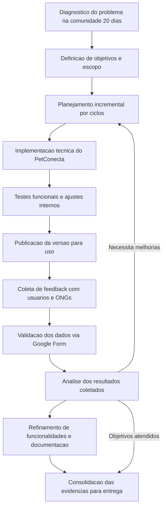

# Diagrama da Metodologia do Projeto (com validacao via Google Form)

## Versao textual curta (para colar no DOCX)

Diagnostico do problema -> Definicao de objetivos -> Planejamento por ciclos -> Implementacao -> Testes -> Publicacao -> Coleta com usuarios/ONGs -> Validacao dos dados via Google Form -> Analise dos resultados -> Refinamento -> Evidencias finais.
