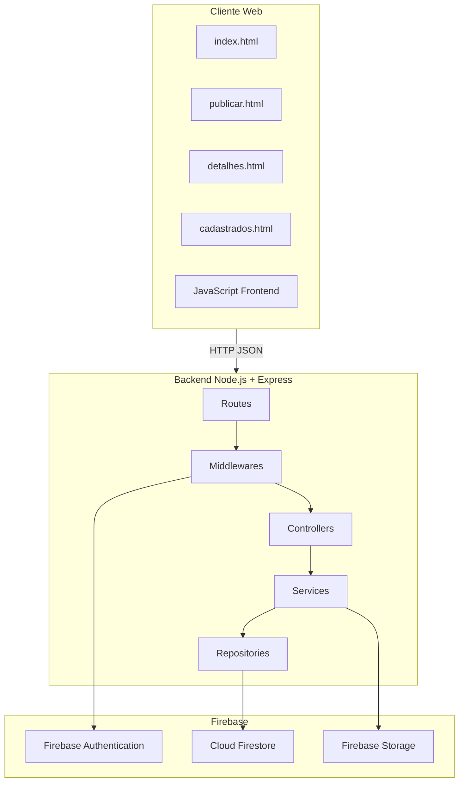
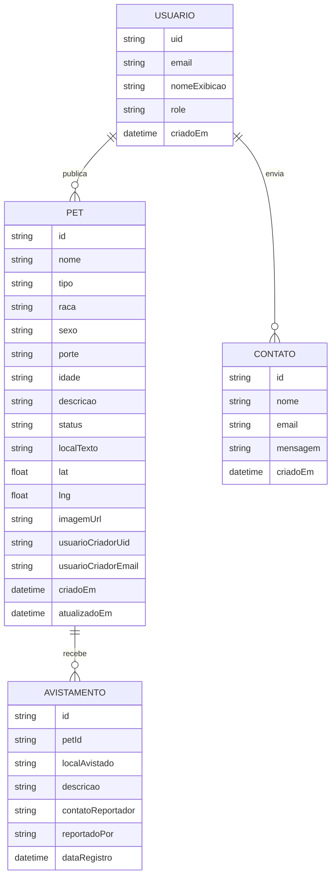
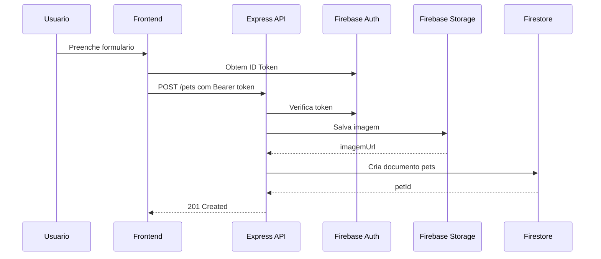
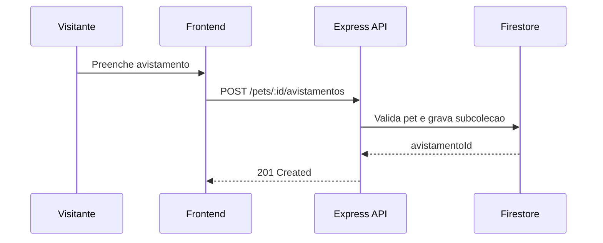

# Modelagem do Site - PetConecta (Node.js + Express + Firebase)

## 1. Contexto e Objetivo

Este documento descreve a modelagem alvo do PetConecta com backend em Node.js + Express e persistencia no Firebase. O foco e orientar evolucao tecnica e entrega academica sem alterar o comportamento atual do sistema.

Objetivos do sistema:

- apoiar tutores na divulgacao de pets desaparecidos;
- permitir registro de avistamentos pela comunidade;
- centralizar regras de negocio e seguranca em API;
- manter Firestore, Authentication e Storage como servicos gerenciados.

## 2. Delimitacao

### 2.1 Escopo

- cadastro, consulta, atualizacao e exclusao de pets;
- registro e consulta de avistamentos;
- consulta de pets do usuario autenticado;
- registro de mensagens de contato.

### 2.2 Fora de escopo

- moderacao automatica por IA (evolucao futura, nao obrigatoria nesta entrega);
- trilha completa de auditoria legal;
- BI avancado e dashboards executivos;
- app mobile nativo.

### 2.3 Premissas

- frontend web continua em HTML/CSS/JavaScript;
- autenticacao usa token do Firebase Auth;
- API valida autenticacao e ownership antes de escrever;
- Firestore permanece como base de dados principal.

## 3. Atores e Requisitos

### 3.1 Atores

- Visitante: consulta pets e registra avistamento.
- Usuario autenticado (tutor): publica pet, edita, exclui e marca encontrado.
- Administrador (futuro): consulta contatos e modera conteudo.

### 3.2 Requisitos funcionais

Observacao: os requisitos funcionais desta versao nao dependem de inteligencia artificial. O uso de IA aparece apenas como possibilidade de evolucao futura e fora do escopo da entrega atual.

- RF01: autenticar usuario com Firebase Authentication.
- RF02: publicar pet com dados estruturados e imagem.
- RF03: listar pets por filtros (status, tipo, regiao).
- RF04: detalhar pet e seus avistamentos.
- RF05: registrar avistamento vinculado ao pet.
- RF06: permitir alteracao e exclusao apenas ao dono.
- RF07: retornar painel Meus Pets por usuario.
- RF08: registrar contatos via endpoint dedicado.

### 3.3 Requisitos nao funcionais

- RNF01: API REST versionada em /api/v1.
- RNF02: validacao de payload em todas as escritas.
- RNF03: autorizacao por token Firebase + ownership.
- RNF04: logs estruturados e codigos HTTP padronizados.
- RNF05: deploy desacoplado entre frontend e backend.

## 4. Arquitetura Logica



## 5. Estrutura Sugerida do Backend

```text
src/
  index.js
  app.js
  config/
    firebaseAdmin.js
  middlewares/
    auth.js
    errorHandler.js
    validate.js
  modules/
    pets/
      pets.routes.js
      pets.controller.js
      pets.service.js
      pets.repository.js
      pets.schema.js
    avistamentos/
      avistamentos.routes.js
      avistamentos.controller.js
      avistamentos.service.js
      avistamentos.repository.js
      avistamentos.schema.js
    contatos/
      contatos.routes.js
      contatos.controller.js
      contatos.service.js
      contatos.repository.js
  shared/
    httpErrors.js
    logger.js
```

## 6. Modelo de Dados



## 7. Modelo Logico no Firestore

Colecoes:

- pets/{petId}
- pets/{petId}/avistamentos/{avistamentoId}
- contatos/{contatoId}
- usuarios/{uid}

Campos-chave em pets:

- status: desaparecido | encontrado | adocao
- usuarioCriadorUid: base da autorizacao
- criadoEm e atualizadoEm: auditoria minima

Indices recomendados:

- pets(status, criadoEm desc)
- pets(usuarioCriadorUid, criadoEm desc)
- pets(tipo, status)

## 8. Contrato da API REST

Base URL:

- /api/v1

Pets:

- POST /pets (auth): cria pet
- GET /pets: lista pets com filtros
- GET /pets/:id: detalha pet
- PUT /pets/:id (auth): atualiza pet do dono
- PATCH /pets/:id/status (auth): altera status
- DELETE /pets/:id (auth): remove pet do dono

Avistamentos:

- POST /pets/:id/avistamentos: cria avistamento
- GET /pets/:id/avistamentos (auth dono): lista avistamentos

Usuario:

- GET /me/pets (auth): lista meus pets

Contato:

- POST /contatos: cria contato
- GET /contatos (auth admin): lista contatos

Padrao de resposta:

- sucesso: objeto com data e metadados (quando aplicavel)
- erro: objeto com code, message e details

Exemplo de erro:

```json
{
  "code": "VALIDATION_ERROR",
  "message": "Payload invalido",
  "details": ["campo nome e obrigatorio"]
}
```

## 9. Fluxos Principais

### 9.1 Publicar pet



### 9.2 Registrar avistamento



## 10. Seguranca e Autorizacao

Camadas:

- middleware auth valida token Firebase no backend;
- service valida ownership por usuarioCriadorUid;
- regras do Firestore bloqueiam escrita direta em colecoes sensiveis.

Diretrizes:

- leitura publica de pets pode permanecer aberta;
- escritas de pets e avistamentos devem ocorrer via API;
- acessos administrativos exigem claim role=admin.

## 11. Rastreabilidade de Requisitos

| Requisito | Endpoint principal          | Regra de seguranca              |
| --------- | --------------------------- | ------------------------------- |
| RF02      | POST /pets                  | auth obrigatoria                |
| RF03      | GET /pets                   | leitura publica                 |
| RF05      | POST /pets/:id/avistamentos | validacao de pet existente      |
| RF06      | PUT/DELETE /pets/:id        | ownership por usuarioCriadorUid |
| RF07      | GET /me/pets                | auth obrigatoria                |

## 12. Riscos e Mitigacoes

- Risco: cliente tentar escrita direta no Firestore.
  Mitigacao: regras restritivas + escrita somente via API.
- Risco: aumento de latencia por camada adicional.
  Mitigacao: consultas enxutas, indices e cache em leitura quente.
- Risco: divergencia entre regras da API e regras do Firestore.
  Mitigacao: checklist unico de autorizacao e testes de contrato.

## 13. Roadmap Tecnico

- Fase 1: mover fluxos de escrita (POST/PUT/DELETE) para Express.
- Fase 2: mover leituras sensiveis (/me/pets e avistamentos privados).
- Fase 3: adicionar rate limit, logs estruturados e testes automatizados.
- Fase 4: adicionar painel administrativo e indicadores de reencontro.

## 14. Conclusao

A arquitetura Node.js + Express com Firebase preserva produtividade e amplia controle de seguranca, manutencao e escalabilidade, sendo adequada para evolucao gradual do PetConecta.
