# Modelagem do Site PetConecta

## Folha de identificação

| Campo      | Informação                                                 |
| ---------- | ---------------------------------------------------------- |
| Projeto    | PetConecta                                                 |
| Tipo       | Aplicação web responsiva                                   |
| Finalidade | Divulgação, localização e reencontro de animais            |
| Contexto   | Projeto acadêmico de Análise e Desenvolvimento de Sistemas |
| Aluno      | Reminson Pessoa Santos                                     |
| RU         | 5287384                                                    |
| Documento  | Modelagem do site e do sistema                             |
| Versão     | 1.1                                                        |
| Data       | 2026-09-03                                                 |
| Situação   | Modelagem baseada na implementação existente               |

> **Nota de leitura:** este documento registra o sistema que existe hoje e identifica evoluções propostas. A arquitetura atualmente implantada é um frontend estático com serviços Firebase. O backend Node.js + Express é uma alternativa de evolução, não uma dependência do fluxo atual.

## 1. Apresentação

O PetConecta é um site para aproximar tutores, pessoas que encontram animais e interessados em adoção. A plataforma permite publicar informações de pets, consultar anúncios em lista e mapa, registrar avistamentos e acompanhar os animais cadastrados pelo usuário.
A modelagem foi elaborada por engenharia reversa do código existente. Por isso, ela serve simultaneamente como documento de Análise e Projeto de Sistemas, especificação funcional e referência para manutenção do site.
Quando um animal desaparece, a divulgação costuma ficar espalhada em redes sociais e grupos de mensagem. Isso dificulta a busca por localização, a atualização do status e o acompanhamento de informações enviadas pela comunidade.

## 2. Problema e justificativa

### 2.1 Problema

Quando um animal desaparece, a divulgação costuma ficar espalhada em redes sociais e grupos de mensagem. Isso dificulta a busca por localização, a atualização do status e o acompanhamento de informações enviadas pela comunidade.

### 2.2 Justificativa

Um ponto centralizado de consulta permite organizar anúncios, tornar a busca mais objetiva e oferecer um canal para que avistamentos cheguem ao tutor. O projeto também contribui para a conscientização sobre cuidados, animais encontrados e adoção responsável.

### 2.3 Beneficiários

- tutores que precisam divulgar e acompanhar um animal;
- pessoas que encontram ou avistam um pet;
- interessados em adoção;
- organizações e projetos de proteção animal;
- comunidade acadêmica, como estudo de uma aplicação web com dados em nuvem.

## 3. Objetivos

### 3.1 Objetivo geral

Desenvolver e modelar uma aplicação web que facilite a divulgação e a localização de animais desaparecidos, encontrados ou disponíveis para adoção.

### 3.2 Objetivos específicos

- permitir autenticação e identificação do responsável pelo anúncio;
- cadastrar pet com imagem, descrição, contato e localização;
- disponibilizar consulta por lista, mapa e detalhes;
- receber avistamentos associados ao pet publicado;
- permitir ao tutor editar, excluir e atualizar o status do anúncio;
- proteger dados de contato de exposição desnecessária;
- oferecer conteúdo informativo sobre cuidados e bem-estar animal.

## 4. Escopo do sistema

### 4.1 Dentro do escopo

- página inicial com listagem e mapa;
- cadastro e login de usuário;
- publicação de pet;
- upload de imagem;
- consulta de detalhes;
- registro de avistamento;
- área Meus Pets;
- popup em tempo real para novos avistamentos dos pets do tutor;
- edição, exclusão e marcação como encontrado;
- páginas de dicas, informativos, contato e termos;
- persistência no Firestore e imagens no Storage.

### 4.2 Fora do escopo atual

- aplicativo mobile nativo;
- moderação automática por inteligência artificial;
- chat em tempo real entre usuários;
- notificações push do navegador ou fora da página;
- pagamento ou doação dentro do site;
- painel administrativo completo;
- integração oficial com abrigos, prefeituras ou serviços veterinários;
- cálculo automático de rota ou busca por distância real.

### 4.3 Premissas e restrições

- o usuário precisa de acesso à internet e navegador moderno;
- a autenticação é feita pelo Firebase Authentication;
- as regras do Firestore são a autoridade para acesso aos dados;
- os campos existentes usam nomes históricos, como `localiza` e `usuarioCriador`;
- a leitura pública de anúncios é necessária para a finalidade do site;
- a modelagem deve respeitar a implementação atual sem apresentar funcionalidades futuras como prontas.

## 5. Stakeholders e atores

| Ator                    | Perfil                       | Necessidades                                      |
| ----------------------- | ---------------------------- | ------------------------------------------------- |
| Visitante               | Pessoa sem login             | Consultar anúncios, mapa, detalhes e informativos |
| Colaborador             | Pessoa que avistou um animal | Enviar avistamento com local, descrição e contato |
| Encontrador autenticado | Pessoa que encontrou um pet  | Publicar achado e acompanhar a devolução          |
| Tutor autenticado       | Responsável pelo anúncio     | Publicar, acompanhar e administrar seus pets      |
| Firebase Authentication | Serviço externo              | Identificar usuários e emitir autenticação        |
| Firestore               | Serviço externo              | Persistir pets e avistamentos                     |
| Firebase Storage        | Serviço externo              | Armazenar imagens dos pets                        |
| Administrador futuro    | Papel proposto               | Moderar conteúdo e consultar indicadores          |

Observação: visitante, colaborador e encontrador representam perfis de uso. No sistema atual, o envio de avistamento e o cadastro de achado exigem autenticação conforme as regras do Firestore.

### 5.1 Personas

| Persona                         | Contexto e necessidade                                                                            | Objetivo no PetConecta                                                  |
| ------------------------------- | ------------------------------------------------------------------------------------------------- | ----------------------------------------------------------------------- |
| Ana, tutora de pet              | Precisa divulgar rapidamente o desaparecimento e acompanhar informações recebidas.                | Publicar o anúncio, consultar avistamentos e atualizar o status do pet. |
| João, colaborador da comunidade | Viu um animal em determinado local e quer ajudar, mesmo tendo pouca familiaridade com tecnologia. | Encontrar o anúncio e registrar um avistamento de forma simples.        |
| Carla, encontradora             | Encontrou um pet sem saber quem é o tutor e possui foto e localização do animal.                  | Publicar o achado para aumentar as chances de devolução.                |
| Marina, voluntária de ONG       | Atua na causa animal e precisa consultar ocorrências e divulgar informações.                      | Acompanhar anúncios, orientar tutores e compartilhar a plataforma.      |
| Visitante interessado em adoção | Busca informações sobre animais e conteúdos de cuidado e bem-estar.                               | Consultar anúncios, informativos e canais de contato disponíveis.       |

As personas representam situações de uso do projeto e não significam que todos os perfis tenham uma conta ou permissões iguais. As operações de publicação, edição, exclusão e registro de avistamento dependem da autenticação prevista nas regras atuais.

## 6. Requisitos

### 6.1 Requisitos funcionais

| ID   | Requisito                             | Prioridade | Critério de aceite                                                                   |
| ---- | ------------------------------------- | ---------- | ------------------------------------------------------------------------------------ |
| RF01 | Cadastrar e autenticar usuário        | Alta       | Usuário válido consegue entrar e permanecer identificado                             |
| RF02 | Publicar pet com dados obrigatórios   | Alta       | Registro é criado somente com autenticação e campos válidos                          |
| RF03 | Enviar imagem do pet                  | Alta       | Imagem e armazenada e sua referencia e salva no pet                                  |
| RF04 | Listar pets por status                | Alta       | Lista exibe registros do Firestore em ordem definida                                 |
| RF05 | Exibir pets em mapa                   | Alta       | Registros com latitude e longitude aparecem no mapa                                  |
| RF06 | Consultar detalhes de um pet          | Alta       | Identificador abre os dados do anúncio selecionado                                   |
| RF07 | Registrar avistamento                 | Alta       | Avistamento fica vinculado ao `petId` correto                                        |
| RF08 | Consultar Meus Pets                   | Alta       | Usuário visualiza apenas seus anúncios                                               |
| RF09 | Editar pet próprio                    | Alta       | Dono consegue atualizar dados permitidos                                             |
| RF10 | Excluir pet próprio                   | Alta       | Dono consegue remover o anúncio autorizado                                           |
| RF11 | Confirmar devolução ou reencontro     | Alta       | Criador altera o status permitido para `encontrado`                                  |
| RF12 | Exibir conteúdo informativo           | Média      | Visitante acessa dicas e informativos sem login                                      |
| RF13 | Enviar mensagem de contato            | Média      | Formulário abre o canal de e-mail com uma mensagem válida                            |
| RF14 | Proteger contato do anunciante        | Alta       | Cards e detalhes não mostram contato sem o fluxo de confirmação                      |
| RF15 | Cadastrar pet encontrado por terceiro | Alta       | Anúncio é criado com status `achado`, prazo de 40 dias e aparece na consulta pública |
| RF16 | Expirar anúncio achado                | Alta       | Anúncio vencido deixa de aparecer; a remoção física depende do TTL configurado       |
| RF17 | Notificar novo avistamento            | Alta       | Tutor recebe popup em Meus Pets quando um novo avistamento é registrado              |

### 6.2 Requisitos não funcionais

| ID    | Categoria        | Requisito verificavel                                                     |
| ----- | ---------------- | ------------------------------------------------------------------------- |
| RNF01 | Usabilidade      | Fluxos principais devem ser compreensíveis em desktop e celular           |
| RNF02 | Responsividade   | Layout deve se adaptar a larguras móveis sem sobreposição                 |
| RNF03 | Segurança        | Escritas devem ser autorizadas por autenticação e regras do Firestore     |
| RNF04 | Privacidade      | Contatos não devem aparecer diretamente nos cards públicos                |
| RNF05 | Desempenho       | Consultas devem usar ordenação, limite e carregamento por blocos          |
| RNF06 | Disponibilidade  | Site deve ser publicado pelo Firebase Hosting                             |
| RNF07 | Manutenibilidade | Integração Firebase deve permanecer centralizada em módulo próprio        |
| RNF08 | Compatibilidade  | Site deve funcionar em navegadores modernos com ES Modules                |
| RNF09 | Acessibilidade   | Imagens, formulários, foco e contrastes devem ser revisados conforme WCAG |
| RNF10 | Integridade      | Pet deve possuir localização numérica válida para uso no mapa             |

### 6.3 Histórias de usuário

| ID   | História de usuário                                                                                                          | Critério de aceite                                                                      | Prioridade |
| ---- | ---------------------------------------------------------------------------------------------------------------------------- | --------------------------------------------------------------------------------------- | ---------- |
| HU01 | Como tutora, quero cadastrar meu pet desaparecido com foto, localização e descrição para aumentar as chances de localizá-lo. | O anúncio é criado com os dados obrigatórios e aparece na consulta pública.             | Alta       |
| HU02 | Como visitante, quero consultar anúncios em lista e mapa para identificar ocorrências próximas ou relevantes.                | A lista e o mapa exibem os anúncios disponíveis com filtros e localização.              | Alta       |
| HU03 | Como colaborador, quero registrar um avistamento relacionado a um pet para informar o tutor sobre uma possível localização.  | O relato é salvo vinculado ao `petId` correto.                                          | Alta       |
| HU04 | Como tutora, quero acessar a área Meus Pets para acompanhar e administrar meus anúncios.                                     | O usuário autenticado visualiza somente os anúncios associados à sua conta.             | Alta       |
| HU05 | Como tutora, quero editar ou excluir meu anúncio para manter as informações atualizadas.                                     | Somente o responsável consegue executar a alteração autorizada.                         | Alta       |
| HU06 | Como encontradora, quero publicar um animal encontrado para que o tutor possa reconhecê-lo e entrar em contato.              | O anúncio é criado com status `achado`, localização e imagem.                           | Alta       |
| HU07 | Como criadora de um anúncio de animal encontrado, quero confirmar a devolução para indicar que o caso foi resolvido.         | O status passa de `achado` para `encontrado` após a confirmação autorizada.             | Média      |
| HU08 | Como visitante, quero ter acesso protegido aos dados de contato para poder ajudar sem expor informações desnecessariamente.  | O contato permanece oculto até a confirmação prevista no fluxo.                         | Alta       |
| HU09 | Como pessoa interessada em cuidados animais, quero consultar dicas e informativos para ampliar meu conhecimento.             | As páginas informativas ficam acessíveis sem login.                                     | Média      |
| HU10 | Como tutora, quero ser avisada quando alguém registrar um avistamento do meu pet para consultar rapidamente as informações.  | Um popup aparece em Meus Pets para cada novo avistamento enquanto a página está aberta. | Alta       |

As histórias de usuário complementam os requisitos e casos de uso. Elas descrevem o valor esperado por cada perfil sem afirmar que a plataforma já produziu reencontros ou impacto comunitário comprovado.

### 6.4 Backlog Kanban

O backlog organiza as histórias e atividades que percorrem as colunas **Backlog**, **Planejado**, **Em andamento**, **Em validação** e **Concluído**. Novas tarefas podem ser adicionadas após o feedback da comunidade.

| ID   | Cartão do backlog                                           | Relacionamento               | Prioridade | Estado       |
| ---- | ----------------------------------------------------------- | ---------------------------- | ---------- | ------------ |
| BK01 | Publicar pet desaparecido com foto e localização            | HU01, RF02, RF03             | Alta       | Concluído    |
| BK02 | Consultar anúncios com filtros e mapa                       | HU02, RF04, RF05             | Alta       | Concluído    |
| BK03 | Exibir detalhes e contato protegido                         | HU02, HU08, RF06, RF14       | Alta       | Concluído    |
| BK04 | Registrar avistamento vinculado ao anúncio                  | HU03, RF07                   | Alta       | Concluído    |
| BK05 | Criar área Meus Pets com edição e exclusão                  | HU04, HU05, RF08, RF09, RF10 | Alta       | Concluído    |
| BK06 | Publicar animal encontrado por terceiro                     | HU06, RF15                   | Alta       | Concluído    |
| BK07 | Confirmar devolução e controlar expiração do achado         | HU07, RF11, RF16             | Alta       | Em validação |
| BK08 | Disponibilizar dicas, informativos e contato                | HU09, RF12, RF13             | Média      | Concluído    |
| BK09 | Realizar validação com tutores, colaboradores e ONGs        | Todas                        | Alta       | Planejado    |
| BK10 | Analisar feedback e priorizar melhorias                     | Todas                        | Alta       | Planejado    |
| BK11 | Revisar acessibilidade e experiência em dispositivos móveis | RNF01, RNF02, RNF09          | Alta       | Em validação |
| BK12 | Moderar imagens antes do upload                             | RF03, RNF03                  | Alta       | Concluído    |
| BK13 | Notificar novos avistamentos na área Meus Pets              | RF07, RF17                   | Alta       | Concluído    |
| BK14 | Consolidar dashboard e evidências comunitárias              | Todas                        | Média      | Em validação |

O backlog não substitui as evidências de aplicação. Os cartões BK09, BK10 e BK14 dependem da conclusão da coleta, da análise das respostas e da organização das evidências comunitárias. Os cartões BK12 e BK13 registram evoluções confirmadas no histórico do projeto: moderação de imagens e alertas de novos avistamentos.

## 7. Casos de uso

### 7.1 Diagrama de contexto

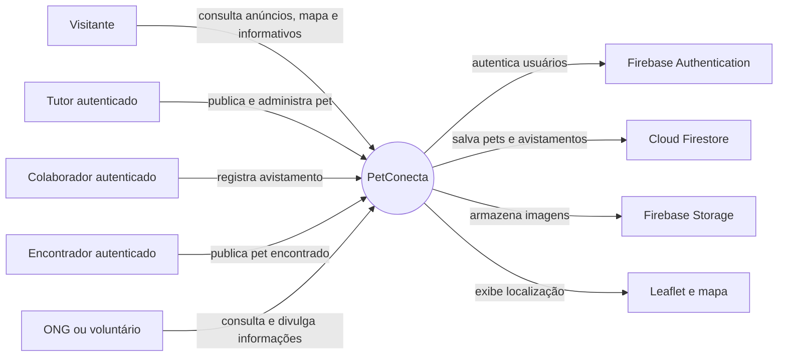

O sistema centraliza os anúncios, avistamentos e informações de apoio. Os serviços Firebase e o mapa são recursos externos que sustentam o funcionamento da aplicação, enquanto os usuários representam os perfis envolvidos na finalidade extensionista.

### 7.2 Fluxo geral do usuário

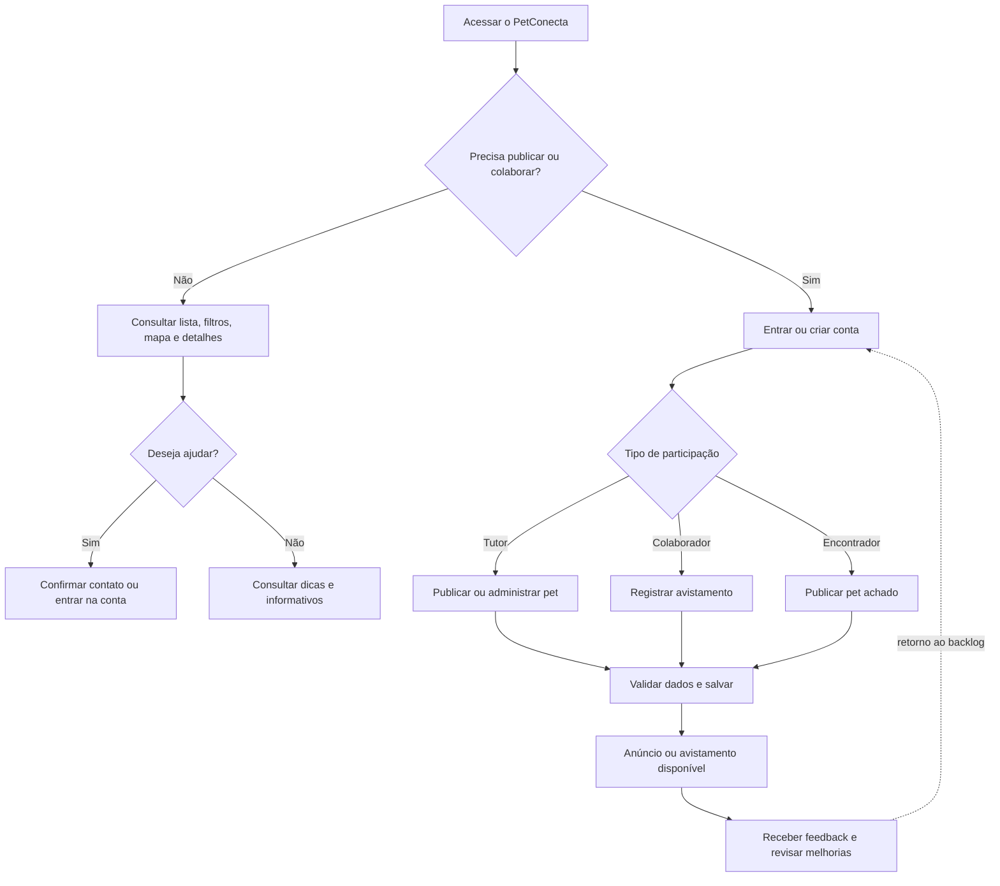

### 7.3 Diagrama geral de casos de uso

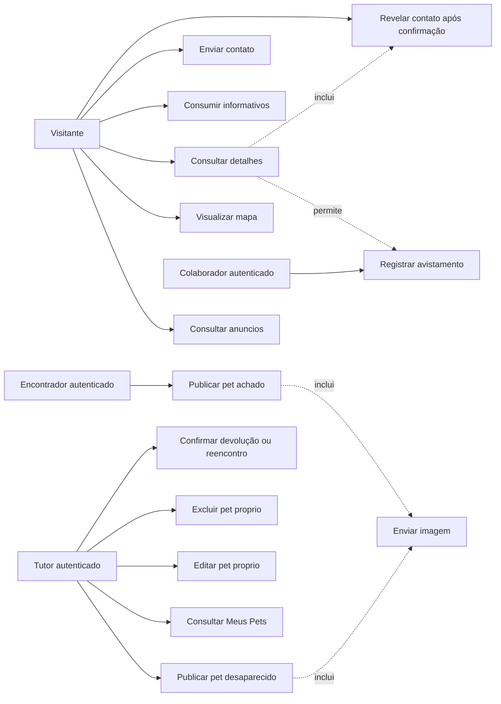

### 7.4 Especificação dos casos de uso

| ID   | Caso de uso                       | Pré-condicao                        | Fluxo principal                                                      | Exceções                                        |
| ---- | --------------------------------- | ----------------------------------- | -------------------------------------------------------------------- | ----------------------------------------------- |
| UC01 | Consultar anúncios                | Site acessível                      | Sistema busca pets, aplica filtro e renderiza cards                  | Falha de rede mostra estado de erro             |
| UC02 | Visualizar mapa                   | Pet possuir coordenadas             | Sistema cria marcadores e associa detalhes                           | Coordenada inválida e ignorada                  |
| UC03 | Consultar detalhes                | Pet existir                         | Usuário abre anúncio e consulta dados                                | ID inexistente retorna ausência do registro     |
| UC04 | Consumir informativos             | Nenhuma                             | Usuário navega por dicas e informativos                              | Página indisponível mostra erro de carregamento |
| UC05 | Enviar contato                    | Formulário aberto                   | Usuário preenche e envia mensagem válida                             | Campos inválidos impedem envio                  |
| UC06 | Registrar avistamento             | Usuário autenticado e pet existente | Usuário informa local, descrição e contato; sistema grava subcoleção | Regra de segurança rejeita dados inválidos      |
| UC07 | Publicar pet                      | Usuário autenticado                 | Preenche formulário, envia imagem e salva pet                        | Upload ou gravação pode falhar                  |
| UC08 | Consultar Meus Pets               | Usuário autenticado                 | Sistema filtra anúncios pelo responsável                             | Sessão expirada redireciona para login          |
| UC09 | Editar pet próprio                | Usuário ser dono                    | Sistema valida alteração e atualiza documento                        | Dono diferente recebe negação                   |
| UC10 | Excluir pet próprio               | Usuário ser dono                    | Sistema exclui pet e recursos associados conforme fluxo              | Operação não autorizada e bloqueada             |
| UC11 | Confirmar devolução ou reencontro | Usuário ser dono                    | Sistema altera status do pet                                         | Status inválido e rejeitado                     |
| UC12 | Publicar pet achado               | Usuário autenticado                 | Sistema cria anúncio com status `achado`                             | Upload ou gravação pode falhar                  |
| UC14 | Revelar contato                   | Visitante                           | Sistema solicita confirmação e libera os canais disponíveis          | Visitante cancela a confirmação                 |

### 7.5 Fluxo alternativo de publicação

1. Usuário acessa `publicar.html`.
2. Sistema verifica a sessão do Firebase Authentication.
3. Usuário preenche nome, tipo, raça, porte, localização, descrição, contato e status.
4. Sistema valida campos e coordenadas.
5. Sistema envia imagem ao Firebase Storage.
6. Sistema grava os metadados na coleção `pets`.
7. Sistema informa sucesso e atualiza a navegação.

Alternativas: se a autenticação, validação, upload ou gravação falhar, o pet não deve ser apresentado como publicado e o usuário deve receber uma mensagem clara.

### 7.6 Especificação formal dos casos críticos

#### UC07 - Publicar pet

- **Ator principal:** tutor autenticado.
- **Pré-condições:** sessão válida; formulário de publicação acessível.
- **Pós-condição de sucesso:** imagem armazenada e documento criado em `pets` com o responsável identificado.
- **Fluxo principal:** autenticar; preencher dados; selecionar local; validar campos; enviar imagem; gravar documento; confirmar publicação.
- **Fluxos alternativos:** imagem inválida; coordenada ausente; sessão expirada; falha de Storage; falha de Firestore.
- **Regras relacionadas:** RN01, RN02, RN04, RN08 e RN09.

#### UC06 - Registrar avistamento

- **Ator principal:** colaborador autenticado.
- **Pré-condições:** pet existente; usuário autenticado; página de detalhes aberta.
- **Pós-condição de sucesso:** novo documento criado em `pets/{petId}/avistamentos`.
- **Fluxo principal:** abrir detalhes; preencher local, descrição e contato; validar dados; gravar ocorrência; informar sucesso.
- **Fluxos alternativos:** pet inexistente; campos inválidos; sessão expirada; regra do Firestore rejeita a escrita.
- **Regras relacionadas:** RN06, RN07 e RN08.

#### UC09 - Editar pet próprio

- **Ator principal:** tutor autenticado.
- **Pré-condições:** pet existente; usuário é responsável pelo documento.
- **Pós-condição de sucesso:** dados autorizados atualizados no mesmo documento.
- **Fluxo principal:** abrir Meus Pets; selecionar anúncio; alterar dados; validar; salvar; atualizar a tela.
- **Fluxos alternativos:** outro usuário tenta editar; campo inválido; documento removido durante a edição.
- **Regras relacionadas:** RN02, RN03 e RN08.

#### UC11 - Confirmar devolução ou reencontro

- **Ator principal:** tutor autenticado.
- **Pré-condições:** pet existente com status `desaparecido` ou `achado`; usuário é responsável.
- **Pós-condição de sucesso:** status alterado para `encontrado`.
- **Fluxo principal:** abrir anúncio próprio; selecionar a ação compatível com o status; confirmar; atualizar para `encontrado`; informar resultado.
- **Fluxos alternativos:** usuário sem permissão; status inválido; falha de conexão.
- **Regras relacionadas:** RN03, RN04 e RN05.

#### UC12 - Publicar pet achado

- **Ator principal:** pessoa autenticada que encontrou o animal.
- **Pré-condições:** sessão válida; localização, imagem e dados obrigatórios disponíveis.
- **Pós-condição de sucesso:** documento criado em `pets` com `status: "achado"` e visível na consulta pública.
- **Fluxo principal:** abrir `publicar_achado.html`; preencher dados; selecionar localização; enviar imagem; gravar anúncio.
- **Fluxos alternativos:** autenticação, validação, upload ou gravação podem falhar.

#### UC14 - Revelar contato

- **Ator principal:** visitante.
- **Pré-condições:** anúncio público possui e-mail ou WhatsApp cadastrado.
- **Pós-condição de sucesso:** visitante confirma a intenção de ajudar e acessa os canais disponíveis.
- **Fluxo principal:** abrir card ou detalhe; selecionar **Revelar contato**; confirmar; abrir WhatsApp ou aplicativo/provedor de e-mail.
- **Fluxo alternativo:** visitante cancela a confirmação e os dados permanecem ocultos.

### 7.7 Diagramas de sequência dos fluxos principais

#### Publicação de pet

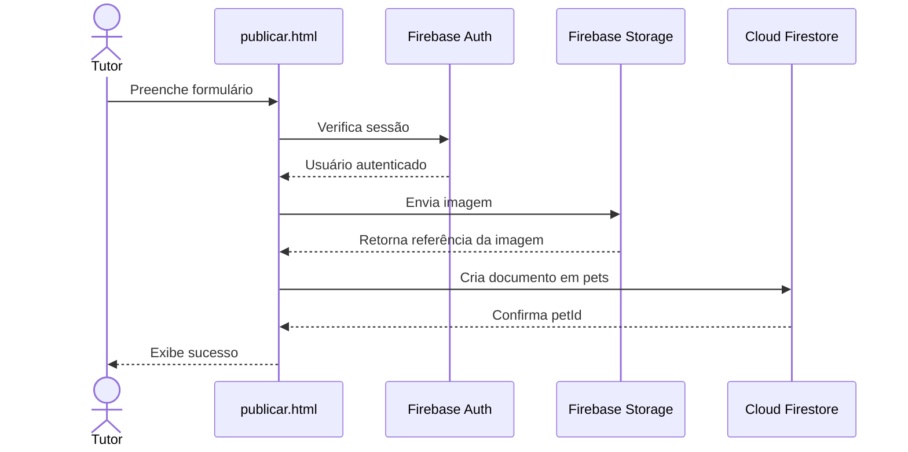

#### Publicação de pet achado por terceiros

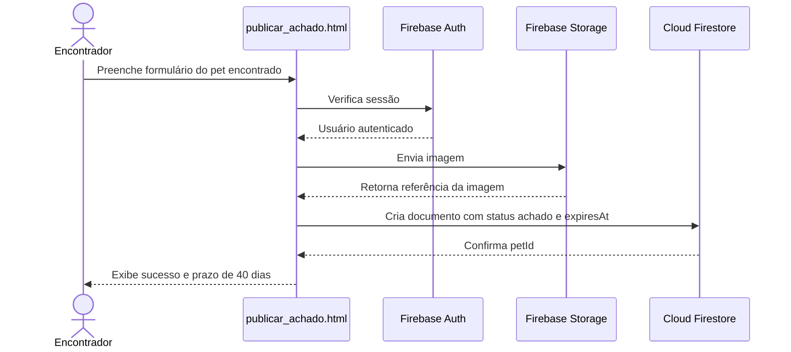

#### Registro de avistamento

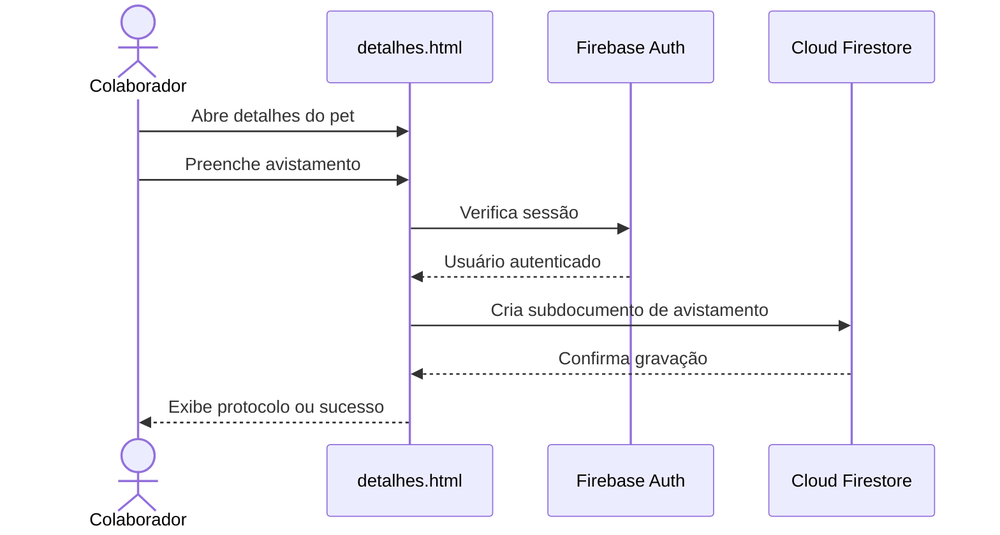

#### Edição e marcação como encontrado

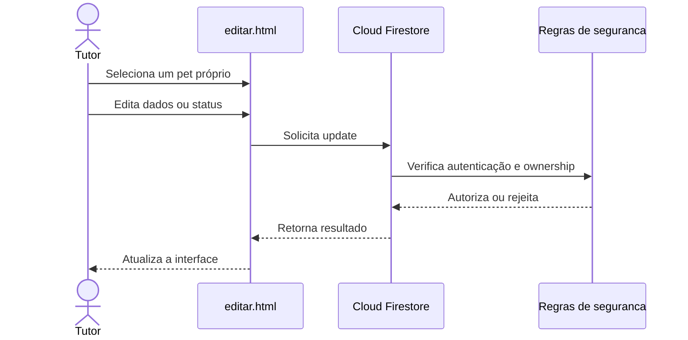

#### Expiração do anúncio achado

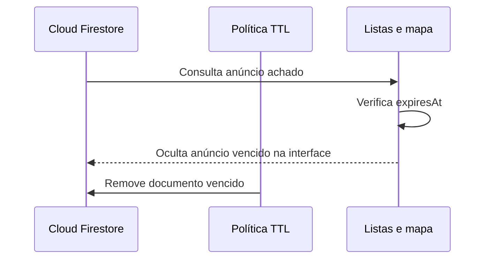

#### Revelação protegida de contato

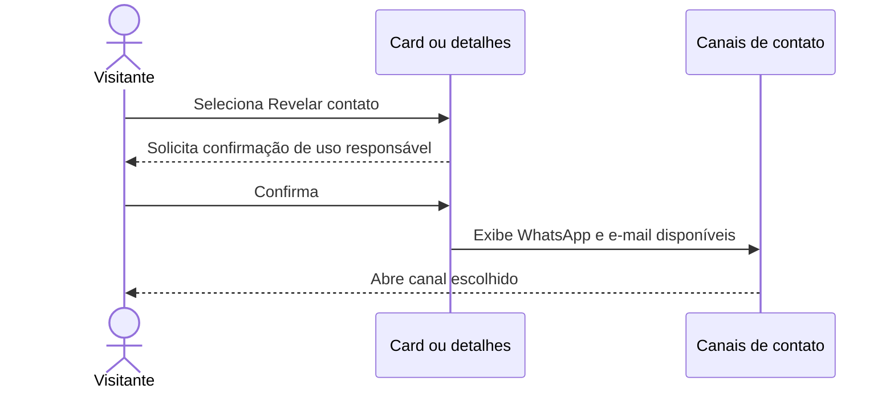

## 8. Modelagem de processos

### 8.1 Atividade: localizar e registrar um avistamento

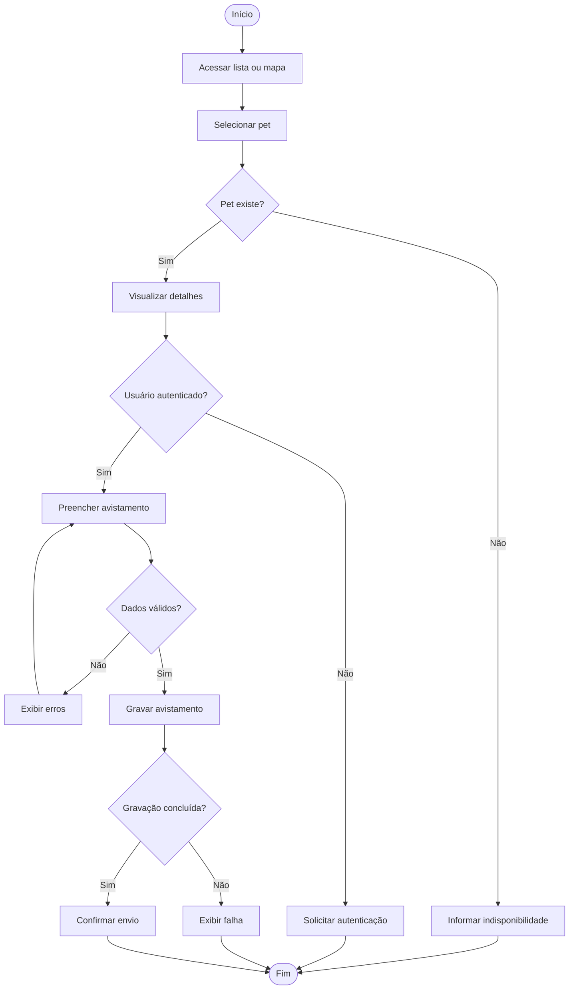

### 8.2 Estados de um anúncio

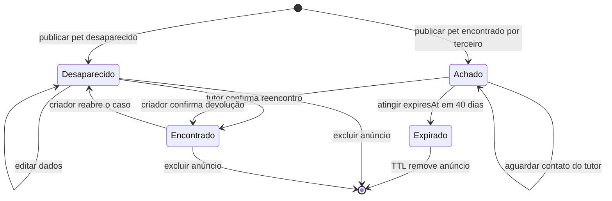

Estados permitidos na regra atual: `desaparecido`, `achado` e `encontrado`. O estado `adocao` aparece em documentos de evolução, mas ainda não deve ser tratado como permitido pelas regras atuais sem alteração prévia.

## 9. Arquitetura do sistema

### 9.1 Visão lógica


### 9.2 Componentes e responsabilidades

| Componente      | Responsabilidade                                                |
| --------------- | --------------------------------------------------------------- |
| Páginas HTML    | Estrutura das telas e formulários                               |
| CSS             | Layout, responsividade, estados visuais e acessibilidade visual |
| `firebase.js`   | Inicialização centralizada de app, Auth, Firestore e Storage    |
| Scripts de tela | Validação, listeners, filtros, renderização e eventos           |
| Authentication  | Login, cadastro e identidade do usuário                         |
| Firestore       | Pets, avistamentos e dados persistentes                         |
| Storage         | Imagens enviadas nos anúncios                                   |
| Leaflet         | Mapa, marcadores e seleção de local                             |
| Hosting         | Distribuição dos arquivos estáticos                             |

### 9.3 Implantação

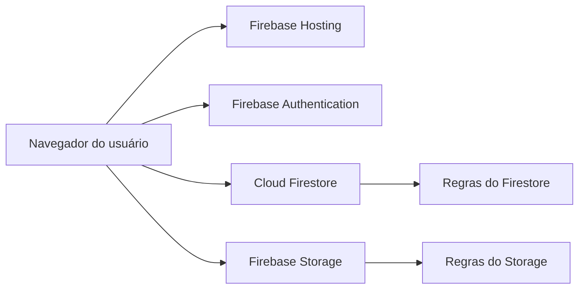

O ambiente atual não exige servidor de aplicação para o fluxo principal. O diretório `src/` contém arquivos auxiliares e uma proposta de serviços Node.js; sua adoção deve ser tratada como evolução arquitetural.

### 9.4 Modelo de componentes


O modelo de componentes mostra responsabilidades lógicas, sem afirmar que todos os módulos possuem uma classe formal. No frontend atual, parte dessas responsabilidades está distribuída entre scripts de tela.

### 9.5 Relação com a fundamentação técnica

A arquitetura foi descrita a partir da separação de responsabilidades, dos
componentes, das interfaces entre serviços e dos fluxos de implantação. Essa
organização dialoga com a literatura de arquitetura de sistemas de Zenker et
al. (2019), sem caracterizar a solução atual como uma arquitetura de
microsserviços: o sistema utiliza serviços gerenciados do Firebase e um
frontend estático.

Os requisitos, atores, casos de uso, diagramas de sequência, estados, modelo
de dados e rastreabilidade foram organizados com base nos princípios de análise
e design orientados a objetos discutidos por Wazlawick (2014) e Rangel e
Carvalho Junior (2021). Como a implementação é feita em JavaScript, os
diagramas representam responsabilidades e contratos do sistema; eles não
afirmam a existência de classes Java ou de uma implementação formal em OCL ou
IFML.

## 10. Mapa de navegação

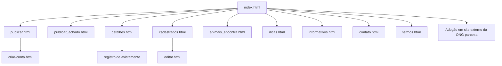

`Adoção` é um redirecionamento externo para `https://www.anjosdajuda.org/adote`, página da ONG parceira. O PetConecta não possui um módulo próprio de adoção nem administra os anúncios exibidos nesse endereço.

## 11. Modelagem de dados

### 11.1 Modelo conceitual

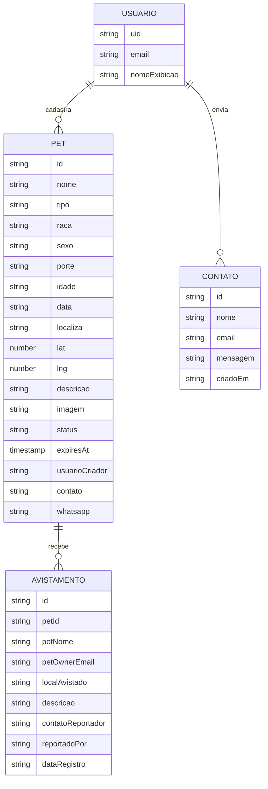

### 11.2 Modelo logico do Firestore

```text
pets/{petId}
pets/{petId}/avistamentos/{avistamentoId}
contatos/{contatoId}                 (estrutura prevista; não usada pelo frontend atual)
usuarios/{uid}                       (estrutura prevista)
```

### 11.3 Dicionário de dados principal

| Entidade/campo                   | Tipo      | Obrigatório | Descrição                                   |
| -------------------------------- | --------- | ----------: | ------------------------------------------- |
| `pets.id`                        | string    |         Sim | Identificador do documento                  |
| `pets.nome`                      | string    |         Sim | Nome ou identificação do animal             |
| `pets.tipo`                      | string    |         Sim | Espécie ou categoria do animal              |
| `pets.raca`                      | string    |         Sim | Raça informada pelo tutor                   |
| `pets.porte`                     | string    |         Sim | Porte do animal                             |
| `pets.status`                    | string    |         Sim | `desaparecido`, `achado` ou `encontrado`    |
| `pets.expiresAt`                 | timestamp |         Não | Data de expiração dos anúncios `achado`     |
| `pets.localiza`                  | string    |         Sim | Local textual do anúncio                    |
| `pets.lat` / `pets.lng`          | number    |         Sim | Coordenadas para o mapa                     |
| `pets.descricao`                 | string    |         Sim | Características e informações adicionais    |
| `pets.imagem`                    | string    |         Sim | URL ou referência da imagem                 |
| `pets.usuarioCriador`            | string    |         Sim | E-mail associado ao usuário autenticado     |
| `pets.contato`                   | string    |         Sim | Meio de contato do tutor                    |
| `pets.whatsapp`                  | string    |         Sim | Contato adicional do tutor                  |
| `avistamentos.petId`             | string    |         Sim | Pet relacionado                             |
| `avistamentos.localAvistado`     | string    |         Sim | Local do avistamento                        |
| `avistamentos.descricao`         | string    |         Sim | Relato do colaborador                       |
| `avistamentos.contatoReportador` | string    |         Sim | Meio de retorno do colaborador              |
| `avistamentos.petOwnerEmail`     | string    |         Sim | Responsável que pode consultar a ocorrência |

A padronização futura deve preferir `localizacao`, `imagemUrl`, `usuarioCriadorUid`, `criadoEm` e `atualizadoEm`. Essa mudança exige migração coordenada entre telas e regras.

### 11.4 Matriz CRUD por ator

| Entidade    | Visitante | Colaborador autenticado | Encontrador dono           | Tutor dono                 |
| ----------- | --------- | ----------------------- | -------------------------- | -------------------------- |
| Pet         | R         | R                       | C, R, U, D                 | C, R, U, D                 |
| Avistamento | R         | C                       | R, U, D conforme ownership | R, U, D conforme ownership |
| Contato     | -         | -                       | -                          | -                          |
| Usuário     | -         | R próprio via Auth      | R próprio via Auth         | R próprio via Auth         |

Legenda: **C** criar, **R** consultar, **U** atualizar, **D** excluir. A matriz representa a regra atual e deve ser revisada caso o sistema passe a separar dados públicos e privados.

### 11.5 Integridade e índices

- a aplicação deve validar que todo avistamento aponta para um pet existente;
- `usuarioCriador` deve corresponder ao e-mail autenticado no cadastro;
- `lat` e `lng` devem ser números dentro dos limites geográficos aceitos;
- consultas de lista devem ordenar por `data` e limitar a quantidade retornada;
- indices adicionais devem ser criados apenas quando uma consulta real exigir.

## 12. Regras de negócio e segurança

- RN01: somente usuário autenticado pode criar pet.
- RN02: o criador do pet é identificado pelo campo `usuarioCriador`.
- RN03: somente o criador pode atualizar ou excluir seu pet.
- RN04: o status inicial deve ser `desaparecido` ou `achado`, conforme o formulário usado.
- RN05: somente o criador pode alterar o status; `achado` passa para `encontrado` após confirmação da devolução.
- RN11: anúncio `achado` recebe `expiresAt` 40 dias após a publicação e é ocultado após o vencimento.
- RN12: o Firestore pode usar TTL em `expiresAt` para excluir fisicamente os anúncios vencidos, desde que a política esteja configurada no projeto.
- RN06: avistamento deve informar o `petId` e os campos obrigatórios.
- RN07: a leitura pública dos avistamentos é uma limitação atual, pois pode expor o contato do colaborador; esse acesso deve ser restringido em evolução futura.
- RN08: validação no navegador melhora a experiência, mas a regra do Firestore é a proteção efetiva contra escrita indevida.
- RN09: imagens devem respeitar as regras de tipo e tamanho do Storage.
- RN10: dados fornecidos por usuários devem ser renderizados como texto seguro, evitando injeção de HTML.

### 12.1 Privacidade e LGPD

O sistema trata nome, e-mail, telefone, WhatsApp e relatos de contato como dados pessoais. Para uma evolução alinhada à LGPD, devem ser observados:

- informar ao usuário a finalidade da coleta antes do cadastro ou envio;
- coletar somente os dados necessários para localizar o pet e retornar ao colaborador;
- restringir o acesso aos contatos quando a funcionalidade permitir;
- permitir solicitação de correção ou exclusão dos dados;
- definir prazo de retenção para anúncios encerrados e avistamentos;
- registrar aceite dos termos quando houver coleta de dados pessoais;
- documentar o responsável pelo tratamento e um canal de contato;
- evitar expor e-mail e WhatsApp em consultas públicas ou URLs.

No estado atual, os termos e a proteção de contato oferecem uma camada inicial, mas não substituem uma política de privacidade completa nem a separação técnica de campos públicos e privados.

## 13. Interfaces e experiência do usuário

| Tela                    | Função                           | Acesso                         |
| ----------------------- | -------------------------------- | ------------------------------ |
| `index.html`            | Home, lista, filtros e mapa      | Público                        |
| `criar-conta.html`      | Login e cadastro                 | Público                        |
| `publicar.html`         | Formulário de publicação         | Autenticado                    |
| `detalhes.html`         | Detalhes e avistamento           | Público/autenticado para envio |
| `cadastrados.html`      | Meus Pets                        | Autenticado                    |
| `editar.html`           | Edição de anúncio                | Dono autenticado               |
| `animais_encontra.html` | Consulta de achados e devolvidos | Público                        |
| `publicar_achado.html`  | Cadastro de pet achado           | Autenticado                    |
| `dicas.html`            | Cuidados com animais             | Público                        |
| `informativos.html`     | Conteúdo informativo             | Público                        |
| `contato.html`          | Mensagem para o projeto          | Público                        |
| `termos.html`           | Termos de uso                    | Público                        |

Diretrizes de interface:

- apresentar estados de carregamento, vazio, sucesso e erro;
- manter formulários com rótulos, mensagens de validação e foco visível;
- usar texto alternativo em imagens relevantes;
- garantir navegação por teclado e contraste adequado;
- manter cards e marcadores consistentes entre lista, mapa e detalhes;
- não revelar contato privado antes da confirmação prevista no fluxo.

### 13.1 Wireframes funcionais

Os wireframes abaixo representam a organização das telas, não o estilo visual final.

```text
HOME / INDEX
+----------------------------------------------------------+
| Logo | Buscar | Filtros | Entrar                         |
+----------------------------------------------------------+
| Mapa com marcadores                                     |
+----------------------------------------------------------+
| Cards de pets: foto | nome | status | local | detalhes  |
+----------------------------------------------------------+
```

```text
PUBLICAR PET
+----------------------------------------------------------+
| Titulo: Publicar pet                                    |
| Foto | Nome | Tipo | Raca | Porte | Status              |
| Localização e seleção no mapa                           |
| Descrição | Contato | WhatsApp                         |
|                         [Cancelar] [Publicar]           |
+----------------------------------------------------------+
```

```text
DETALHES DO PET
+----------------------------------------------------------+
| Foto e identificação | Status | Localização            |
| Descrição e características                           |
| Contato protegido [Revelar contato]                    |
| Formulário de avistamento                             |
|                         [Enviar avistamento]           |
+----------------------------------------------------------+
```

```text
MEUS PETS
+----------------------------------------------------------+
| Usuário | Sair                                           |
| Pet 1: status | [Editar] [Devolvido ao Tutor] [Excluir] |
| Pet 2: status | [Editar] [Devolvido ao Tutor] [Excluir] |
+----------------------------------------------------------+
```

## 14. Critérios de aceitação

Os critérios abaixo complementam os requisitos e podem ser usados na demonstracao:

| Requisito | Dado                          | Quando                        | Entao                                       |
| --------- | ----------------------------- | ----------------------------- | ------------------------------------------- |
| RF01      | Usuário sem sessão            | informar credenciais válidas  | sistema autentica e identifica o usuário    |
| RF02      | Usuário autenticado           | preencher campos obrigatórios | sistema cria o pet e confirma a publicação  |
| RF05      | Pet com coordenadas válidas   | abrir a home                  | sistema apresenta marcador correspondente   |
| RF07      | Pet existente e sessão válida | enviar avistamento completo   | sistema grava a ocorrência vinculada ao pet |
| RF09      | Pet do usuário atual          | salvar alteração válida       | sistema atualiza o documento                |
| RF10      | Pet de outro usuário          | tentar excluir                | regra rejeita a operação                    |
| RF11      | Pet achado do usuário         | confirmar devolução           | sistema altera o status para encontrado     |
| RNF02     | Tela em viewport mobile       | navegar e abrir formulários   | conteúdo permanece legível e utilizável     |
| RNF04     | Listagem pública              | carregar cards                | contato não é exibido diretamente           |

## 15. Plano de testes e validação

| ID  | Cenario                                  | Resultado esperado                                       |
| --- | ---------------------------------------- | -------------------------------------------------------- |
| T01 | Visitante abre a home                    | Lista e mapa carregam ou exibem estado vazio/erro        |
| T02 | Usuário tenta publicar sem login         | Acesso é bloqueado ou redirecionado                      |
| T03 | Publicação com campo obrigatório vazio   | Formulário informa o campo e não grava                   |
| T04 | Publicação com coordenada inválida       | Operação é rejeitada                                     |
| T05 | Publicação válida com imagem             | Imagem sobe e pet aparece na lista                       |
| T06 | Usuário tenta editar pet de outro        | Firestore rejeita a operação                             |
| T07 | Tutor edita o próprio pet                | Alterações aparecem nos detalhes                         |
| T08 | Criador confirma devolução ou reencontro | Status muda para `encontrado`                            |
| T15 | Pessoa autenticada publica pet achado    | Anúncio surge na lista e no mapa com distinção visual    |
| T16 | Visitante tenta alterar status           | Nenhum botao de alteração e disponibilizado              |
| T17 | Achado ultrapassa 40 dias                | Anúncio deixa de aparecer e aguarda exclusão por TTL     |
| T18 | Usuário autenticado abre Meus Pets       | Sistema exibe somente os anúncios do usuário             |
| T09 | Colaborador registra avistamento valido  | Ocorrencia e criada no pet correto                       |
| T10 | Avistamento sem autenticação             | Operação é bloqueada pela regra vigente                  |
| T11 | Contato na listagem pública              | Contato não aparece diretamente                          |
| T12 | Navegação em celular                     | Conteúdo não sobrepõe e controles permanecem utilizáveis |
| T13 | Dado com caracteres especiais            | Texto aparece sem executar HTML                          |
| T14 | Imagem inexistente ou pesada             | Sistema trata erro e preserva o layout                   |

A validação acadêmica deve combinar testes funcionais, verificacao visual responsiva, inspecao das regras do Firebase e conferencia dos critérios de aceite.

## 16. Matriz de rastreabilidade

| Requisito | Caso de uso | Tela/componente         | Persistencia ou regra      | Teste    |
| --------- | ----------- | ----------------------- | -------------------------- | -------- |
| RF01      | UC07, UC08  | `criar-conta.html`      | Firebase Authentication    | T02      |
| RF02      | UC07        | `publicar.html`         | `pets`, regra `create`     | T03, T05 |
| RF03      | UC07        | Formulario de imagem    | Firebase Storage           | T05, T14 |
| RF04      | UC01        | `index.html`            | Query Firestore            | T01      |
| RF05      | UC02        | Home/mapa               | `lat`, `lng`, Leaflet      | T01, T04 |
| RF06      | UC03        | `detalhes.html`         | `pets/{petId}`             | T01      |
| RF07      | UC06        | Detalhes                | `avistamentos`             | T09, T10 |
| RF08      | UC08        | `cadastrados.html`      | Filtro por responsável     | T18      |
| RF09      | UC09        | `editar.html`           | Regra `update`             | T07      |
| RF10      | UC10        | `cadastrados.html`      | Regra `delete`             | T06      |
| RF11      | UC11        | `animais_encontra.html` | Acao do criador e `status` | T08      |
| RF15      | UC12        | `publicar_achado.html`  | `pets.status = achado`     | T15      |
| RF16      | UC12        | Listas e mapa           | `pets.expiresAt` + TTL     | T17      |
| RF14      | UC03        | Detalhes e encontrados  | Fluxo de confirmação       | T11      |

## 17. Riscos e mitigações

| Risco                    | Impacto                            | Mitigacao                                  |
| ------------------------ | ---------------------------------- | ------------------------------------------ |
| Exposicao de contato     | Spam e perda de privacidade        | Ocultar na lista e exigir confirmação      |
| Escrita indevida         | Alteracao de anúncios de terceiros | Authentication e regras do Firestore       |
| XSS por dados de usuário | Comprometimento da sessão          | Renderização segura com texto e elementos  |
| Muitas leituras          | Custo e lentidao                   | `limit`, ordenacao e listeners controlados |
| Imagens pesadas          | Carregamento lento                 | Validar tamanho, proporcao e lazy loading  |
| Campos inconsistentes    | Falha entre telas                  | Dicionario e plano de migracao             |
| Falha de servico externo | Indisponibilidade parcial          | Estados de erro e mensagens claras         |

## 18. Evolução planejada

1. padronizar nomes de campos e adicionar `criadoEm` e `atualizadoEm`;
2. separar dados públicos e privados de contato;
3. implementar filtro por distancia usando coordenadas;
4. criar página de adoção com regras proprias;
5. adicionar perfil administrativo e moderacao;
6. configurar App Check em producao;
7. incluir notificacoes de novos avistamentos;
8. avaliar a API Node.js + Express quando a regra de negócio exigir backend próprio;
9. criar indicadores de anúncios, avistamentos e reencontros;
10. executar testes automatizados de regras e fluxos criticos.

### 18.1 Glossário do domínio

| Termo            | Definicao                                                    |
| ---------------- | ------------------------------------------------------------ |
| Pet              | Animal cadastrado na plataforma                              |
| Tutor            | Usuário responsável por um anúncio                           |
| Colaborador      | Pessoa que informa um avistamento ou contribui com a busca   |
| Avistamento      | Relato de que um animal foi visto em determinado local       |
| Anúncio          | Documento público com dados de um pet                        |
| Desaparecido     | Status de um pet cuja localização está sendo procurada       |
| Encontrado       | Status de um pet cujo reencontro foi informado pelo tutor    |
| Ownership        | Regra que vincula uma operação ao responsável pelo documento |
| Firebase Storage | Serviço usado para armazenar imagens                         |
| Firestore        | Banco de dados usado para pets e avistamentos                |

### 18.2 Referências

- RANGEL, Pablo; CARVALHO JUNIOR, José Gomes de. _Sistemas orientados a objetos: teoria e prática com UML e Java_. Rio de Janeiro: Brasport, 2021. ISBN 9786588431412.
- SANTOS, Selma Cristina dos; CARVALHO, Márcia Alves Faleiro de. _Normas e técnicas para elaboração e apresentação de trabalhos acadêmicos_. 1. ed. São Paulo: Vozes, 2015. ISBN 9788532650061.
- PEROVANO, Dalton Gean. _Manual de metodologia da pesquisa científica_. Curitiba: Intersaberes, 2016.
- MARQUES, Biblioteca Universitária Mario O. _Guia Unijuí de formatação de trabalhos acadêmico-científicos_. 3. ed. Ijuí: Editora Unijuí, 2023. ISBN 9788541903820.
- LISBOA, Flávio. _Arquitetura de software distribuído: boas práticas para um mundo de microsserviços_. São Paulo, SP: Casa do Código, 2021. ISBN 9786586110876.
- BRASILEIRO, Ada Magaly M. _Como produzir textos acadêmicos e científicos_. São Paulo: Editora Contexto, 2021. ISBN 9786555414400.
- ZENKER, Aline M.; SANTOS, Jailson Costa dos; COUTO, Júlia M. C.; et al. _Arquitetura de sistemas_. Porto Alegre: SAGAH, 2019. ISBN 9788595029767.
- WAZLAWICK, Raul S. _Análise e Design Orientados a Objetos para Sistemas de Informação: Modelagem com UML, OCL e IFML_. 3. ed. Rio de Janeiro: GEN LTC, 2014. ISBN 9788595153653.
- OBJECT MANAGEMENT GROUP. _Unified Modeling Language (UML), Version 2.5.1_. Disponivel em: <https://www.omg.org/spec/UML/2.5.1/>. Acesso em: 19 ago. 2026.
- SOMMERVILLE, Ian. _Engenharia de Software_. Sao Paulo: Pearson, 2019.
- BRASIL. _Lei Geral de Protecao de Dados Pessoais - Lei n. 13.709/2018_. Disponivel em: <https://www.planalto.gov.br/ccivil_03/_ato2015-2018/2018/lei/l13709.htm>. Acesso em: 19 ago. 2026.
- FIREBASE. _Documentacao do Firebase_. Disponivel em: <https://firebase.google.com/docs>. Acesso em: 19 ago. 2026.
- W3C. _Web Content Accessibility Guidelines (WCAG) 2.2_. Disponivel em: <https://www.w3.org/TR/WCAG22/>. Acesso em: 19 ago. 2026.

### 18.3 Ferramentas utilizadas na modelagem e documentação

- Mermaid: modelagem textual de diagramas de caso de uso, processo, estados, arquitetura e sequência.
- Markdown: consolidacao dos artefatos tecnicos e rastreabilidade da modelagem.
- Visual Studio Code: edição dos diagramas, documentos e revisão de consistencia.
- Python (`python-docx` e `Pillow`): geracao de diagrama em imagem e incorporacao no arquivo DOCX exigido na entrega.

Observacao: na entrega acadêmica, os diagramas tecnicos foram mantidos em Mermaid para rastreabilidade e manutenção, e o diagrama da metodologia foi incorporado no documento final em formato compativel com o modelo da disciplina.

## 19. Conclusão

A modelagem apresenta o PetConecta sob as perspectivas de negócio, requisitos, comportamento, dados, arquitetura, navegação, segurança, interface e validação. Ela representa o estado atual do site sem confundir funcionalidades propostas com funcionalidades implementadas e oferece uma base para apresentação acadêmica, manutenção e evolução do sistema.

Os documentos complementares são:

- [arquitetura.md](arquitetura.md): decisoes tecnicas e operacionais;
- [README.md](../README.md): visão geral e instruções de execução.
