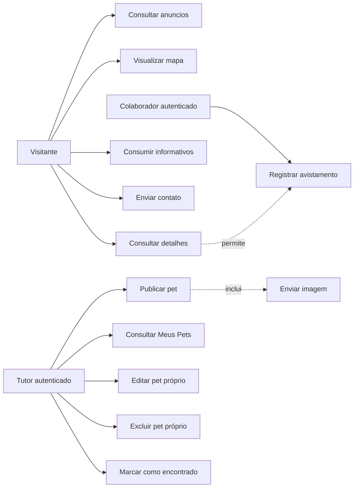
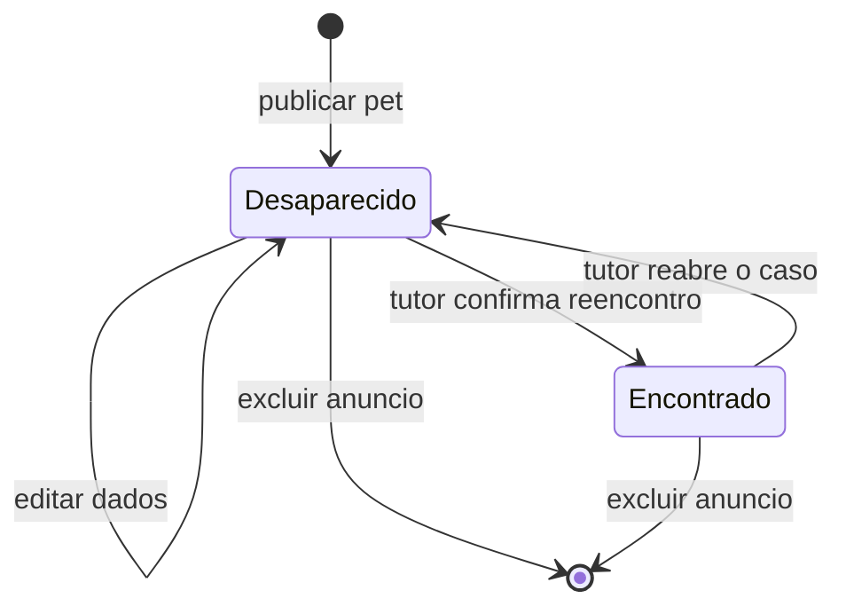
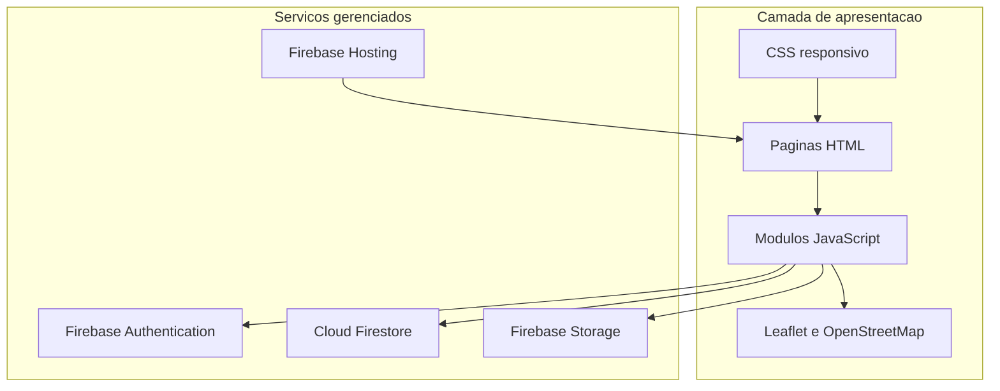
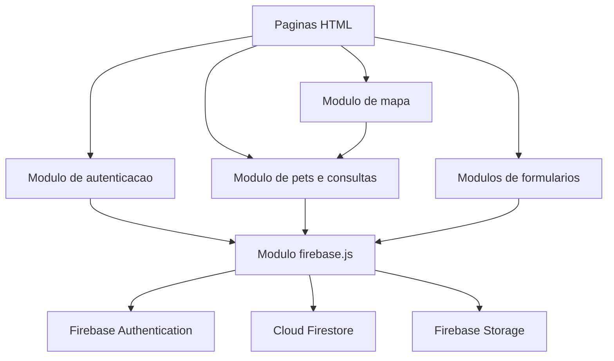
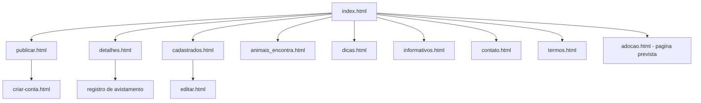
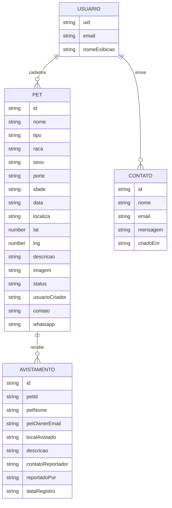

# Modelagem do Site PetConecta

## Folha de identificação

| Campo      | Informação                                                 |
| ---------- | ---------------------------------------------------------- |
| Projeto    | PetConecta                                                 |
| Tipo       | Aplicação web responsiva                                   |
| Finalidade | Divulgação, localização e reencontro de animais            |
| Contexto   | Projeto acadêmico de Analise e Desenvolvimento de Sistemas |
| Documento  | Modelagem do site e do sistema                             |
| Versão     | 1.0                                                        |
| Data       | 2026-08-19                                                 |
| Situação   | Modelagem baseada na implementacao existente               |

> **Nota de leitura:** este documento registra o sistema que existe hoje e identifica evoluções propostas. A arquitetura atualmente implantada e frontend estático com serviços Firebase; o backend Node.js + Express descrito em [modelagem-node-express-firebase.md](modelagem-node-express-firebase.md) e uma alternativa de evolução, não uma dependência do fluxo atual.

## 1. Apresentacao

O PetConecta e um site para aproximar tutores, pessoas que encontram animais e interessados em adoção. A plataforma permite publicar informações de pets, consultar anúncios em lista e mapa, registrar avistamentos e acompanhar os animais cadastrados pelo usuário.

A modelagem foi elaborada por engenharia reversa do código existente. Por isso, ela serve simultaneamente como documento de Análise e Projeto de Sistemas, especificação funcional e referência para manutenção do site.

## 2. Problema e justificativa

### 2.1 Problema

Quando um animal desaparece, a divulgacao costuma ficar espalhada em redes sociais e grupos de mensagem. Isso dificulta a busca por localização, a atualização do status e o acompanhamento de informações enviadas pela comunidade.

### 2.2 Justificativa

Um ponto centralizado de consulta permite organizar anúncios, tornar a busca mais objetiva e oferecer um canal para que avistamentos cheguem ao tutor. O projeto tambem contribui para a conscientização sobre cuidados, animais encontrados e adoção responsável.

### 2.3 Beneficiários

- tutores que precisam divulgar e acompanhar um animal;
- pessoas que encontram ou avistam um pet;
- interessados em adoção;
- organizacoes e projetos de protecao animal;
- comunidade acadêmica, como estudo de uma aplicação web com dados em nuvem.

## 3. Objetivos

### 3.1 Objetivo geral

Desenvolver e modelar uma aplicação web que facilite a divulgação e a localização de animais desaparecidos, encontrados ou disponíveis para adoção.

### 3.2 Objetivos especificos

- permitir autenticação e identificação do responsável pelo anúncio;
- cadastrar pet com imagem, descrição, contato e localização;
- disponibilizar consulta por lista, mapa e detalhes;
- receber avistamentos associados ao pet publicado;
- permitir ao tutor editar, excluir e atualizar o status do anúncio;
- proteger dados de contato de exposição desnecessária;
- oferecer conteúdo informativo sobre cuidados e bem-estar animal.

## 4. Escopo do sistema

### 4.1 Dentro do escopo

- página inicial com listagem e mapa;
- cadastro e login de usuário;
- publicação de pet;
- upload de imagem;
- consulta de detalhes;
- registro de avistamento;
- área Meus Pets;
- edição, exclusão e marcação como encontrado;
- páginas de dicas, informativos, contato e termos;
- persistência no Firestore e imagens no Storage.

### 4.2 Fora do escopo atual

- aplicativo mobile nativo;
- moderação automática por inteligência artificial;
- chat em tempo real entre usuários;
- notificações push;
- pagamento ou doação dentro do site;
- painel administrativo completo;
- integração oficial com abrigos, prefeituras ou serviços veterinários;
- cálculo automático de rota ou busca por distância real.

### 4.3 Premissas e restrições

- o usuario precisa de acesso a internet e navegador moderno;
- a autenticacao e feita pelo Firebase Authentication;
- as regras do Firestore sao a autoridade para acesso aos dados;
- os campos existentes usam nomes históricos, como `localiza` e `usuarioCriador`;
- a leitura pública de anúncios e necessária para a finalidade do site;
- a modelagem deve respeitar a implementação atual sem apresentar funcionalidades futuras como prontas.

## 5. Stakeholders e atores

| Ator                    | Perfil                       | Necessidades                                      |
| ----------------------- | ---------------------------- | ------------------------------------------------- |
| Visitante               | Pessoa sem login             | Consultar anúncios, mapa, detalhes e informativos |
| Colaborador             | Pessoa que avistou um animal | Enviar avistamento com local, descrição e contato |
| Tutor autenticado       | Responsável pelo anúncio     | Publicar, acompanhar e administrar seus pets      |
| Firebase Authentication | Servico externo              | Identificar usuários e emitir autenticação        |
| Firestore               | Servico externo              | Persistir pets e avistamentos                     |
| Firebase Storage        | Servico externo              | Armazenar imagens dos pets                        |
| Administrador futuro    | Papel proposto               | Moderar conteudo e consultar indicadores          |

Observacao: visitante e colaborador representam perfis de uso. No sistema atual, o envio de avistamento exige autenticação conforme as regras do Firestore.

## 6. Requisitos

### 6.1 Requisitos funcionais

| ID   | Requisito                           | Prioridade | Criterio de aceite                                                     |
| ---- | ----------------------------------- | ---------- | ---------------------------------------------------------------------- |
| RF01 | Cadastrar e autenticar usuário      | Alta       | Usuário válido consegue entrar e permanecer identificado               |
| RF02 | Publicar pet com dados obrigatórios | Alta       | Registro e criado somente com autenticação e campos válidos            |
| RF03 | Enviar imagem do pet                | Alta       | Imagem e armazenada e sua referência e salva no pet                    |
| RF04 | Listar pets por status              | Alta       | Lista exibe registros do Firestore em ordem definida                   |
| RF05 | Exibir pets em mapa                 | Alta       | Registros com latitude e longitude aparecem no mapa                    |
| RF06 | Consultar detalhes de um pet        | Alta       | Identificador abre os dados do anúncio selecionado                     |
| RF07 | Registrar avistamento               | Alta       | Avistamento fica vinculado ao `petId` correto                          |
| RF08 | Consultar Meus Pets                 | Alta       | Usuário visualiza apenas seus anúncios                                 |
| RF09 | Editar pet próprio                  | Alta       | Dono consegue atualizar dados permitidos                               |
| RF10 | Excluir pet próprio                 | Alta       | Dono consegue remover o anúncio autorizado                             |
| RF11 | Marcar pet como encontrado          | Alta       | Status muda para `encontrado` e deixa de ser tratado como desaparecido |
| RF12 | Exibir conteúdo informativo         | Media      | Visitante acessa dicas e informativos sem login                        |
| RF13 | Enviar mensagem de contato          | Media      | Formulário registra uma mensagem válida                                |
| RF14 | Proteger contato do anunciante      | Alta       | Listagem não mostra contato sem o fluxo de confirmação                 |

### 6.2 Requisitos não funcionais

| ID    | Categoria        | Requisito verificável                                                     |
| ----- | ---------------- | ------------------------------------------------------------------------- |
| RNF01 | Usabilidade      | Fluxos principais devem ser compreensíveis em desktop e celular           |
| RNF02 | Responsividade   | Layout deve se adaptar a larguras móveis sem sobreposição                 |
| RNF03 | Seguranca        | Escritas devem ser autorizadas por autenticação e regras do Firestore     |
| RNF04 | Privacidade      | Contatos nao devem aparecer diretamente nos cards públicos                |
| RNF05 | Desempenho       | Consultas devem usar ordenação, limite e carregamento por blocos          |
| RNF06 | Disponibilidade  | Site deve ser publicado pelo Firebase Hosting                             |
| RNF07 | Manutenibilidade | Integracao Firebase deve permanecer centralizada em modulo próprio        |
| RNF08 | Compatibilidade  | Site deve funcionar em navegadores modernos com ES Modules                |
| RNF09 | Acessibilidade   | Imagens, formulários, foco e contrastes devem ser revisados conforme WCAG |
| RNF10 | Integridade      | Pet deve possuir localização numérica válida para uso no mapa             |

## 7. Casos de uso

### 7.1 Diagrama geral



### 7.2 Especificacao dos casos de uso

| ID   | Caso de uso            | Pre-condicao                        | Fluxo principal                                                      | Excecoes                                        |
| ---- | ---------------------- | ----------------------------------- | -------------------------------------------------------------------- | ----------------------------------------------- |
| UC01 | Consultar anúncios     | Site acessivel                      | Sistema busca pets, aplica filtro e renderiza cards                  | Falha de rede mostra estado de erro             |
| UC02 | Visualizar mapa        | Pet possuir coordenadas             | Sistema cria marcadores e associa detalhes                           | Coordenada inválida e ignorada                  |
| UC03 | Consultar detalhes     | Pet existir                         | Usuario abre anúncio e consulta dados                                | ID inexistente retorna ausência do registro     |
| UC04 | Consumir informativos  | Nenhuma                             | Usuario navega por dicas e informativos                              | Pagina indisponível mostra erro de carregamento |
| UC05 | Enviar contato         | Formulario aberto                   | Usuario preenche e envia mensagem válida                             | Campos inválidos impedem envio                  |
| UC06 | Registrar avistamento  | Usuário autenticado e pet existente | Usuario informa local, descrição e contato; sistema grava subcoleção | Regra de segurança rejeita dados inválidos      |
| UC07 | Publicar pet           | Usuário autenticado                 | Preenche formulário, envia imagem e salva pet                        | Upload ou gravação pode falhar                  |
| UC08 | Consultar Meus Pets    | Usuário autenticado                 | Sistema filtra anúncios pelo responsável                             | Sessão expirada redireciona para login          |
| UC09 | Editar pet próprio     | Usuário ser dono                    | Sistema valida alteração e atualiza documento                        | Dono diferente recebe negação                   |
| UC10 | Excluir pet próprio    | Usuário ser dono                    | Sistema exclui pet e recursos associados conforme fluxo              | Operação não autorizada e bloqueada             |
| UC11 | Marcar como encontrado | Usuário ser dono                    | Sistema altera status do pet                                         | Status inválido e rejeitado                     |

### 7.3 Fluxo alternativo de publicação

1. Usuário acessa `publicar.html`.
2. Sistema verifica a sessao do Firebase Authentication.
3. Usuario preenche nome, tipo, raca, porte, localização, descrição, contato e status.
4. Sistema válida campos e coordenadas.
5. Sistema envia imagem ao Firebase Storage.
6. Sistema grava os metadados na coleção `pets`.
7. Sistema informa sucesso e atualiza a navegação.

Alternativas: se a autenticação, validação, upload ou gravação falhar, o pet não deve ser apresentado como publicado e o usuário deve receber uma mensagem clara.

### 7.4 Especificação formal dos casos críticos

#### UC07 - Publicar pet

- **Ator principal:** tutor autenticado.
- **Pre-condicoes:** sessão válida; formulário de publicacao acessível.
- **Pos-condicao de sucesso:** imagem armazenada e documento criado em `pets` com o responsável identificado.
- **Fluxo principal:** autenticar; preencher dados; selecionar local; validar campos; enviar imagem; gravar documento; confirmar publicação.
- **Fluxos alternativos:** imagem inválida; coordenada ausente; sessão expirada; falha de Storage; falha de Firestore.
- **Regras relacionadas:** RN01, RN02, RN04, RN08 e RN09.

#### UC06 - Registrar avistamento

- **Ator principal:** colaborador autenticado.
- **Pre-condicoes:** pet existente; usuário autenticado; página de detalhes aberta.
- **Pos-condicao de sucesso:** novo documento criado em `pets/{petId}/avistamentos`.
- **Fluxo principal:** abrir detalhes; preencher local, descrição e contato; validar dados; gravar ocorrência; informar sucesso.
- **Fluxos alternativos:** pet inexistente; campos invalidos; sessao expirada; regra do Firestore rejeita a escrita.
- **Regras relacionadas:** RN06, RN07 e RN08.

#### UC09 - Editar pet proprio

- **Ator principal:** tutor autenticado.
- **Pre-condicoes:** pet existente; usuario e responsavel pelo documento.
- **Pos-condicao de sucesso:** dados autorizados atualizados no mesmo documento.
- **Fluxo principal:** abrir Meus Pets; selecionar anuncio; alterar dados; validar; salvar; atualizar a tela.
- **Fluxos alternativos:** outro usuário tenta editar; campo inválido; documento removido durante a edição.
- **Regras relacionadas:** RN02, RN03 e RN08.

#### UC11 - Marcar como encontrado

- **Ator principal:** tutor autenticado.
- **Pre-condicoes:** pet existente com status `desaparecido`; usuario e responsável.
- **Pos-condicao de sucesso:** status alterado para `encontrado`.
- **Fluxo principal:** abrir anúncio próprio; selecionar a ação; confirmar; atualizar status; informar resultado.
- **Fluxos alternativos:** usuário sem permissão; status inválido; falha de conexão.
- **Regras relacionadas:** RN03, RN04 e RN05.

### 7.5 Diagramas de sequencia dos fluxos principais

#### Publicacao de pet


#### Registro de avistamento


#### Edicao e marcacao como encontrado


## 8. Modelagem de processos

### 8.1 Atividade: localizar e registrar um avistamento


### 8.2 Estados de um anuncio



Estados permitidos na regra atual: `desaparecido` e `encontrado`. O estado `adocao` aparece em documentos de evolucao, mas ainda nao deve ser tratado como permitido pelas regras atuais sem alteracao previa.

## 9. Arquitetura do sistema

### 9.1 Visao logica



### 9.2 Componentes e responsabilidades

| Componente      | Responsabilidade                                                |
| --------------- | --------------------------------------------------------------- |
| Páginas HTML    | Estrutura das telas e formulários                               |
| CSS             | Layout, responsividade, estados visuais e acessibilidade visual |
| `firebase.js`   | Inicialização centralizada de app, Auth, Firestore e Storage    |
| Scripts de tela | Validacao, listeners, filtros, renderização e eventos           |
| Authentication  | Login, cadastro e identidade do usuário                         |
| Firestore       | Pets, avistamentos e dados persistentes                         |
| Storage         | Imagens enviadas nos anúncios                                   |
| Leaflet         | Mapa, marcadores e seleção de local                             |
| Hosting         | Distribuição dos arquivos estáticos                             |

### 9.3 Implantação


O ambiente atual nao exige servidor de aplicação para o fluxo principal. O diretório `src/` contem arquivos auxiliares e uma proposta de servicos Node.js; sua adocao deve ser tratada como evolução arquitetural.

### 9.4 Modelo de componentes



O modelo de componentes mostra responsabilidades lógicas, sem afirmar que todos os módulos possuem uma classe formal. No frontend atual, parte dessas responsabilidades está distribuida entre scripts de tela.

## 10. Mapa de navegação



`adocao.html` e uma pagina prevista na organizacao funcional, mas nao esta presente na estrutura atual; por isso, a navegacao deve ser implementada somente quando o fluxo de adocao for definido.

## 11. Modelagem de dados

### 11.1 Modelo conceitual



### 11.2 Modelo logico do Firestore

```text
pets/{petId}
pets/{petId}/avistamentos/{avistamentoId}
contatos/{contatoId}                 (fluxo de contato)
usuarios/{uid}                       (estrutura prevista)
```

### 11.3 Dicionário de dados principal

| Entidade/campo                   | Tipo   | Obrigatorio | Descricao                                   |
| -------------------------------- | ------ | ----------: | ------------------------------------------- |
| `pets.id`                        | string |         Sim | Identificador do documento                  |
| `pets.nome`                      | string |         Sim | Nome ou identificacao do animal             |
| `pets.tipo`                      | string |         Sim | Espécie ou categoria do animal              |
| `pets.raca`                      | string |         Sim | Raça informada pelo tutor                   |
| `pets.porte`                     | string |         Sim | Porte do animal                             |
| `pets.status`                    | string |         Sim | `desaparecido` ou `encontrado`              |
| `pets.localiza`                  | string |         Sim | Local textual do anuncio                    |
| `pets.lat` / `pets.lng`          | number |         Sim | Coordenadas para o mapa                     |
| `pets.descricao`                 | string |         Sim | Caracteristicas e informações adicionais    |
| `pets.imagem`                    | string |         Sim | URL ou referência da imagem                 |
| `pets.usuarioCriador`            | string |         Sim | E-mail associado ao usuário autenticado     |
| `pets.contato`                   | string |         Sim | Meio de contato do tutor                    |
| `pets.whatsapp`                  | string |         Sim | Contato adicional do tutor                  |
| `avistamentos.petId`             | string |         Sim | Pet relacionado                             |
| `avistamentos.localAvistado`     | string |         Sim | Local do avistamento                        |
| `avistamentos.descricao`         | string |         Sim | Relato do colaborador                       |
| `avistamentos.contatoReportador` | string |         Sim | Meio de retorno do colaborador              |
| `avistamentos.petOwnerEmail`     | string |         Sim | Responsável que pode consultar a ocorrência |

A padronizacao futura deve preferir `localizacao`, `imagemUrl`, `usuarioCriadorUid`, `criadoEm` e `atualizadoEm`. Essa mudanca exige migracao coordenada entre telas e regras.

### 11.5 Matriz CRUD por ator

| Entidade    | Visitante | Colaborador autenticado | Tutor dono                 |
| ----------- | --------- | ----------------------- | -------------------------- |
| Pet         | R         | R                       | C, R, U, D                 |
| Avistamento | R         | C, R conforme regra     | R, U, D conforme ownership |
| Contato     | C         | C                       | C                          |
| Usuario     | -         | R proprio via Auth      | R proprio via Auth         |

Legenda: **C** criar, **R** consultar, **U** atualizar, **D** excluir. A matriz representa a regra atual e deve ser revisada caso o sistema passe a separar dados públicos e privados.

### 11.4 Integridade e indices

- todo avistamento deve apontar para um pet existente;
- `usuarioCriador` deve corresponder ao e-mail autenticado no cadastro;
- `lat` e `lng` devem ser numeros dentro dos limites geográficos aceitos;
- consultas de lista devem ordenar por `data` e limitar a quantidade retornada;
- índices adicionais devem ser criados apenas quando uma consulta real exigir.

## 12. Regras de negócio e seguranca

- RN01: somente usuario autenticado pode criar pet.
- RN02: o criador do pet e identificado pelo campo `usuarioCriador`.
- RN03: somente o criador pode atualizar ou excluir seu pet.
- RN04: o status inicial deve ser `desaparecido` ou outro status aceito pela regra vigente.
- RN05: o tutor pode marcar o próprio pet como `encontrado`.
- RN06: avistamento deve informar o `petId` e os campos obrigatórios.
- RN07: avistamentos podem ser lidos publicamente conforme regra atual, mas a aplicação deve evitar exposição desnecessária de contatos.
- RN08: validação no navegador melhora a experiência, mas a regra do Firestore e a proteção efetiva contra escrita indevida.
- RN09: imagens devem respeitar as regras de tipo e tamanho do Storage.
- RN10: dados fornecidos por usuarios devem ser renderizados como texto seguro, evitando injeção de HTML.

### 12.1 Privacidade e LGPD

O sistema trata nome, e-mail, telefone, WhatsApp e relatos de contato como dados pessoais. Para uma evolução alinhada a LGPD, devem ser observados:

- informar ao usuário a finalidade da coleta antes do cadastro ou envio;
- coletar somente os dados necessários para localizar o pet e retornar ao colaborador;
- restringir o acesso aos contatos quando a funcionalidade permitir;
- permitir solicitação de correção ou exclusão dos dados;
- definir prazo de retenção para anúncios encerrados e avistamentos;
- registrar aceite dos termos quando houver coleta de dados pessoais;
- documentar o responsável pelo tratamento e um canal de contato;
- evitar expor e-mail e WhatsApp em consultas públicas ou URLs.

No estado atual, os termos e a protecao de contato oferecem uma camada inicial, mas nao substituem uma politica de privacidade completa nem a separacao técnica de campos públicos e privados.

## 13. Interfaces e experiencia do usuario

| Tela                    | Funcao                      | Acesso                         |
| ----------------------- | --------------------------- | ------------------------------ |
| `index.html`            | Home, lista, filtros e mapa | Público                        |
| `criar-conta.html`      | Login e cadastro            | Público                        |
| `publicar.html`         | Formulário de publicação    | Autenticado                    |
| `detalhes.html`         | Detalhes e avistamento      | Público/autenticado para envio |
| `cadastrados.html`      | Meus Pets                   | Autenticado                    |
| `editar.html`           | Edição de anúncio           | Dono autenticado               |
| `animais_encontra.html` | Consulta de encontrados     | Público                        |
| `dicas.html`            | Cuidados com animais        | Público                        |
| `informativos.html`     | Conteúdo informativo        | Público                        |
| `contato.html`          | Mensagem para o projeto     | Público                        |
| `termos.html`           | Termos de uso               | Público                        |

Diretrizes de interface:

- apresentar estados de carregamento, vazio, sucesso e erro;
- manter formularios com rotulos, mensagens de validacao e foco visivel;
- usar texto alternativo em imagens relevantes;
- garantir navegacao por teclado e contraste adequado;
- manter cards e marcadores consistentes entre lista, mapa e detalhes;
- nao revelar contato privado antes da confirmacao prevista no fluxo.

### 13.1 Wireframes funcionais

Os wireframes abaixo representam a organizacao das telas, nao o estilo visual final.

```text
HOME / INDEX
+----------------------------------------------------------+
| Logo | Buscar | Filtros | Entrar                         |
+----------------------------------------------------------+
| Mapa com marcadores                                     |
+----------------------------------------------------------+
| Cards de pets: foto | nome | status | local | detalhes  |
+----------------------------------------------------------+
```

```text
PUBLICAR PET
+----------------------------------------------------------+
| Titulo: Publicar pet                                    |
| Foto | Nome | Tipo | Raca | Porte | Status              |
| Localizacao e selecao no mapa                           |
| Descricao | Contato | WhatsApp                         |
|                         [Cancelar] [Publicar]           |
+----------------------------------------------------------+
```

```text
DETALHES DO PET
+----------------------------------------------------------+
| Foto e identificacao | Status | Localizacao            |
| Descricao e caracteristicas                           |
| Contato protegido [Revelar contato]                    |
| Formulario de avistamento                             |
|                         [Enviar avistamento]           |
+----------------------------------------------------------+
```

```text
MEUS PETS
+----------------------------------------------------------+
| Usuario | Sair                                           |
| Pet 1: status | [Editar] [Encontrado] [Excluir]         |
| Pet 2: status | [Editar] [Encontrado] [Excluir]         |
+----------------------------------------------------------+
```

## 14.1 Criterios de aceitacao

Os criterios abaixo complementam os requisitos e podem ser usados na demonstracao:

| Requisito | Dado                          | Quando                        | Entao                                       |
| --------- | ----------------------------- | ----------------------------- | ------------------------------------------- |
| RF01      | Usuario sem sessao            | informar credenciais validas  | sistema autentica e identifica o usuario    |
| RF02      | Usuario autenticado           | preencher campos obrigatorios | sistema cria o pet e confirma a publicacao  |
| RF05      | Pet com coordenadas validas   | abrir a home                  | sistema apresenta marcador correspondente   |
| RF07      | Pet existente e sessao valida | enviar avistamento completo   | sistema grava a ocorrencia vinculada ao pet |
| RF09      | Pet do usuario atual          | salvar alteracao valida       | sistema atualiza o documento                |
| RF10      | Pet de outro usuario          | tentar excluir                | regra rejeita a operacao                    |
| RF11      | Pet desaparecido do usuario   | confirmar reencontro          | sistema altera o status para encontrado     |
| RNF02     | Tela em viewport mobile       | navegar e abrir formularios   | conteudo permanece legivel e utilizavel     |
| RNF04     | Listagem publica              | carregar cards                | contato nao e exibido diretamente           |

## 14. Plano de testes e validacao

| ID  | Cenario                                 | Resultado esperado                                       |
| --- | --------------------------------------- | -------------------------------------------------------- |
| T01 | Visitante abre a home                   | Lista e mapa carregam ou exibem estado vazio/erro        |
| T02 | Usuario tenta publicar sem login        | Acesso e bloqueado ou redirecionado                      |
| T03 | Publicacao com campo obrigatorio vazio  | Formulario informa o campo e nao grava                   |
| T04 | Publicacao com coordenada invalida      | Operacao e rejeitada                                     |
| T05 | Publicacao valida com imagem            | Imagem sobe e pet aparece na lista                       |
| T06 | Usuario tenta editar pet de outro       | Firestore rejeita a operacao                             |
| T07 | Tutor edita o proprio pet               | Alteracoes aparecem nos detalhes                         |
| T08 | Tutor marca pet como encontrado         | Status e atualizado                                      |
| T09 | Colaborador registra avistamento valido | Ocorrencia e criada no pet correto                       |
| T10 | Avistamento sem autenticacao            | Operacao e bloqueada pela regra vigente                  |
| T11 | Contato na listagem publica             | Contato nao aparece diretamente                          |
| T12 | Navegacao em celular                    | Conteudo nao sobrepoe e controles permanecem utilizaveis |
| T13 | Dado com caracteres especiais           | Texto aparece sem executar HTML                          |
| T14 | Imagem inexistente ou pesada            | Sistema trata erro e preserva o layout                   |

A validacao academica deve combinar testes funcionais, verificacao visual responsiva, inspecao das regras do Firebase e conferencia dos criterios de aceite.

## 15. Matriz de rastreabilidade

| Requisito | Caso de uso | Tela/componente      | Persistencia ou regra   | Teste    |
| --------- | ----------- | -------------------- | ----------------------- | -------- |
| RF01      | UC07, UC08  | `criar-conta.html`   | Firebase Authentication | T02      |
| RF02      | UC07        | `publicar.html`      | `pets`, regra `create`  | T03, T05 |
| RF03      | UC07        | Formulario de imagem | Firebase Storage        | T05, T14 |
| RF04      | UC01        | `index.html`         | Query Firestore         | T01      |
| RF05      | UC02        | Home/mapa            | `lat`, `lng`, Leaflet   | T01, T04 |
| RF06      | UC03        | `detalhes.html`      | `pets/{petId}`          | T01      |
| RF07      | UC06        | Detalhes             | `avistamentos`          | T09, T10 |
| RF08      | UC08        | `cadastrados.html`   | Filtro por responsavel  | T06      |
| RF09      | UC09        | `editar.html`        | Regra `update`          | T07      |
| RF10      | UC10        | `cadastrados.html`   | Regra `delete`          | T06      |
| RF11      | UC11        | `editar.html`        | Campo `status`          | T08      |
| RF14      | UC03        | Detalhes/lista       | Fluxo de confirmacao    | T11      |

## 16. Riscos e mitigacoes

| Risco                    | Impacto                            | Mitigacao                                  |
| ------------------------ | ---------------------------------- | ------------------------------------------ |
| Exposicao de contato     | Spam e perda de privacidade        | Ocultar na lista e exigir confirmacao      |
| Escrita indevida         | Alteracao de anuncios de terceiros | Authentication e regras do Firestore       |
| XSS por dados de usuario | Comprometimento da sessao          | Renderizacao segura com texto e elementos  |
| Muitas leituras          | Custo e lentidao                   | `limit`, ordenacao e listeners controlados |
| Imagens pesadas          | Carregamento lento                 | Validar tamanho, proporcao e lazy loading  |
| Campos inconsistentes    | Falha entre telas                  | Dicionario e plano de migracao             |
| Falha de servico externo | Indisponibilidade parcial          | Estados de erro e mensagens claras         |

## 17. Evolucao planejada

1. padronizar nomes de campos e adicionar `criadoEm` e `atualizadoEm`;
2. separar dados públicos e privados de contato;
3. implementar filtro por distancia usando coordenadas;
4. criar página de adoção com regras próprias;
5. adicionar perfil administrativo e moderação;
6. configurar App Check em produção;
7. incluir notificações de novos avistamentos;
8. avaliar a API Node.js + Express quando a regra de negócio exigir backend próprio;
9. criar indicadores de anúncios, avistamentos e reencontros;
10. executar testes automatizados de regras e fluxos criticos.

### 17.1 Glossario do dominio

| Termo            | Definicao                                                    |
| ---------------- | ------------------------------------------------------------ |
| Pet              | Animal cadastrado na plataforma                              |
| Tutor            | Usuario responsavel por um anuncio                           |
| Colaborador      | Pessoa que informa um avistamento ou contribui com a busca   |
| Avistamento      | Relato de que um animal foi visto em determinado local       |
| Anuncio          | Documento publico com dados de um pet                        |
| Desaparecido     | Status de um pet cuja localizacao esta sendo procurada       |
| Encontrado       | Status de um pet cujo reencontro foi informado pelo tutor    |
| Ownership        | Regra que vincula uma operacao ao responsavel pelo documento |
| Firebase Storage | Servico usado para armazenar imagens                         |
| Firestore        | Banco de dados usado para pets e avistamentos                |

### 17.2 Referencias

- OBJECT MANAGEMENT GROUP. _Unified Modeling Language (UML), Version 2.5.1_. Disponivel em: <https://www.omg.org/spec/UML/2.5.1/>. Acesso em: 19 ago. 2026.
- SOMMERVILLE, Ian. _Engenharia de Software_. Sao Paulo: Pearson, 2019.
- BRASIL. _Lei Geral de Protecao de Dados Pessoais - Lei n. 13.709/2018_. Disponivel em: <https://www.planalto.gov.br/ccivil_03/_ato2015-2018/2018/lei/l13709.htm>. Acesso em: 19 ago. 2026.
- FIREBASE. _Documentacao do Firebase_. Disponivel em: <https://firebase.google.com/docs>. Acesso em: 19 ago. 2026.
- W3C. _Web Content Accessibility Guidelines (WCAG) 2.2_. Disponivel em: <https://www.w3.org/TR/WCAG22/>. Acesso em: 19 ago. 2026.

### 17.3 Ferramentas utilizadas na modelagem e documentacao

- Mermaid: modelagem textual de diagramas de caso de uso, processo, estados, arquitetura e sequencia.
- Markdown: consolidacao dos artefatos tecnicos e rastreabilidade da modelagem.
- Visual Studio Code: edicao dos diagramas, documentos e revisao de consistencia.
- Python (`python-docx` e `Pillow`): geracao de diagrama em imagem e incorporacao no arquivo DOCX exigido na entrega.

Observacao: na entrega acadêmica, os diagramas técnicos foram mantidos em Mermaid para rastreabilidade e manutenção, e o diagrama da metodologia foi incorporado no documento final em formato compatível com o modelo da disciplina.

## 18. Conclusão

A modelagem apresenta o PetConecta sob as perspectivas de negócio, requisitos, comportamento, dados, arquitetura, navegação, seguranca, interface e validação. Ela representa o estado atual do site sem confundir funcionalidades propostas com funcionalidades implementadas e oferece uma base para apresentação acadêmica, manutenção e evolução do sistema.

Os documentos complementares são:

- [arquitetura.md](arquitetura.md): decisoes tecnicas e operacionais;
- [riscos-e-mitigacoes.md](riscos-e-mitigacoes.md): riscos observados e mitigações;
- [modelagem-node-express-firebase.md](modelagem-node-express-firebase.md): alternativa de backend futuro;
- [README.md](../README.md): visão geral e instruções de execução.
