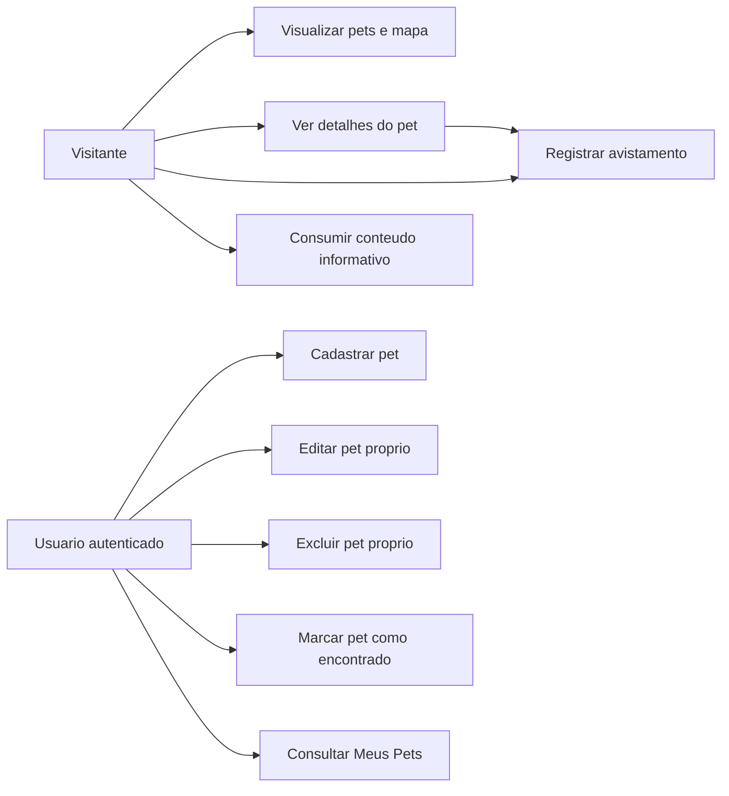
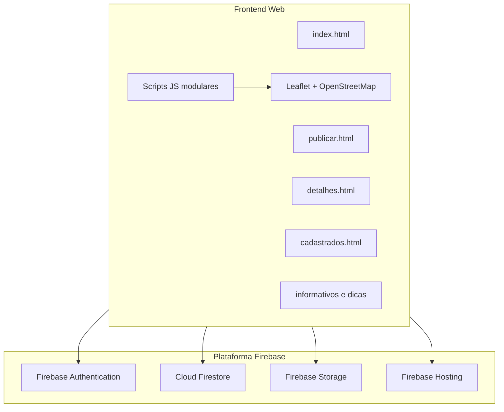
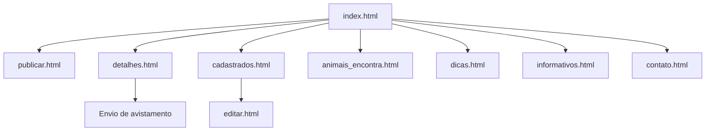
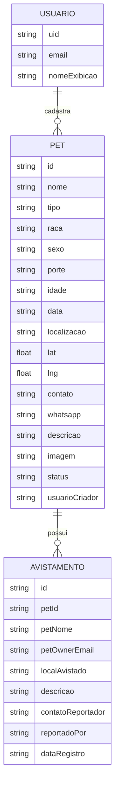
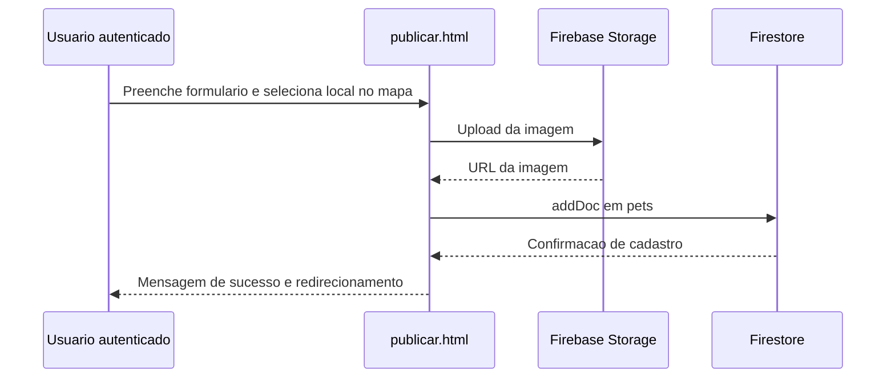
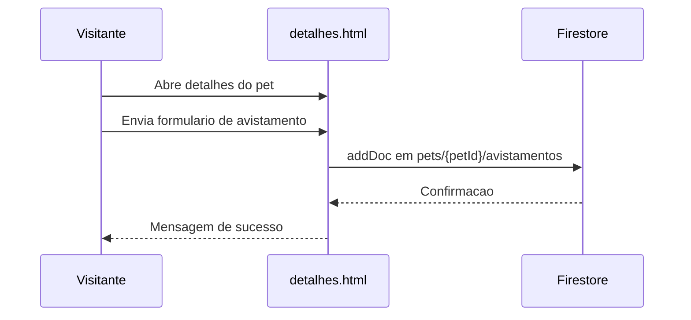

# Modelagem do Site - PetConecta

## 1. Contexto e Objetivo

Este documento apresenta a modelagem do sistema PetConecta a partir da analise do codigo ja implementado (engenharia reversa), com foco em apoiar entrega academica.

Objetivo do sistema:

- apoiar tutores na divulgacao de pets desaparecidos;
- permitir que a comunidade registre avistamentos;
- oferecer conteudo informativo de apoio sobre cuidados e saude animal.

## 2. Escopo Funcional

### 2.1 Atores

- Visitante: visualiza pets, mapa e conteudo informativo.
- Usuario autenticado (tutor): cadastra pet, edita, exclui e marca como encontrado.
- Colaborador da comunidade: registra avistamento em pet publicado.

### 2.2 Requisitos funcionais principais

- RF01: autenticar usuario para cadastro e gestao de pets.
- RF02: cadastrar pet com dados, localizacao e imagem.
- RF03: listar pets em cards e no mapa.
- RF04: exibir detalhes do pet por identificador.
- RF05: registrar avistamento vinculado ao pet.
- RF06: permitir ao tutor editar/excluir seu proprio pet.
- RF07: permitir ao tutor atualizar status para encontrado.
- RF08: exibir area Meus Pets e avistamentos relacionados.

### 2.3 Requisitos nao funcionais principais

- RNF01: responsividade para dispositivos moveis.
- RNF02: persistencia em nuvem com Firebase/Firestore.
- RNF03: controle de acesso por regras de seguranca no Firestore.
- RNF04: disponibilidade web via Firebase Hosting.

## 3. Modelagem de Casos de Uso

## 4. Arquitetura Logica

## 5. Mapa de Navegacao (Sitemap)

## 6. Modelo Conceitual de Dados

## 7. Modelo Logico (Firestore)

Colecao principal:

- pets/{petId}

Subcolecao:

- pets/{petId}/avistamentos/{avistamentoId}

Observacoes de regra e seguranca (extraidas de firestore.rules):

- leitura de pets e avistamentos: publica;
- criacao de pet: exige usuario autenticado e campo usuarioCriador igual ao email autenticado;
- update/delete de pet: permitido apenas ao criador;
- criacao de avistamento: publica com validacao de campos obrigatorios;
- update/delete de avistamento: permitido ao tutor dono do pet.

## 8. Fluxos Principais (Sequencia)

### 8.1 Cadastro de pet

### 8.2 Registro de avistamento

## 9. Regras de Negocio

- RN01: somente usuario autenticado pode cadastrar pet.
- RN02: somente criador do pet pode editar, excluir e marcar encontrado.
- RN03: avistamento e sempre vinculado a um pet existente.
- RN04: status padrao do pet no cadastro e desaparecido.
- RN05: localizacao do pet utiliza coordenadas geograficas para mapa e filtros.

## 10. Limites e Evolucao Recomendada

- implementar filtro real de proximidade por distancia geografica (ex.: raio em km com Haversine);
- consolidar padrao de nomes de campos (tipo/raca/localiza/localizacao);
- incluir trilha de auditoria com data de criacao e atualizacao em todos os documentos;
- criar indicadores analiticos para taxa de reencontro por periodo.

## 11. Conclusao

A modelagem acima representa o sistema PetConecta de forma aderente ao estado atual da implementacao e pode ser usada como base de entrega academica em disciplinas de Analise e Projeto de Sistemas, Engenharia de Software ou Banco de Dados.
